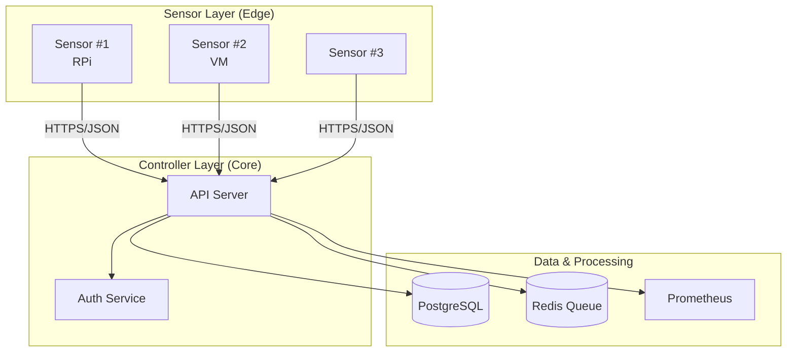
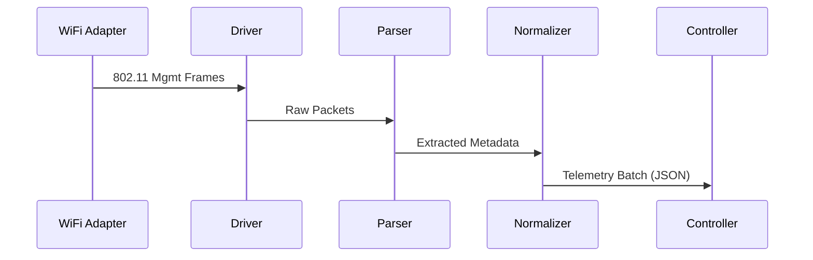

<h1 align="center">Sentinel NetLab</h1>

<p align="center">
  <strong>Lightweight Hybrid Wireless Intrusion Detection System</strong>
</p>

<p align="center">
<p align="center">
  <a href="https://github.com/anduong1200/sentinel-netlab/actions"></a>
  <a href="LICENSE"></a>
  <a href="https://www.python.org/downloads/"></a>
  <a href="https://github.com/astral-sh/ruff"></a>
</p>
</p>

<p align="center">
  A research-focused WiFi security monitoring platform combining signature-based detection with ML-enhanced anomaly analysis for educational and authorized security testing environments.
</p>

> [!TIP]
> **📚 Documentation**: Start here → **[docs/README.md](docs/README.md)**  
> (Supports **Lab Mode** and **Production Deployment**)

---

## 🎯 Overview

Sentinel NetLab is a distributed wireless intrusion detection system designed for:

- **Security Research** — Study WiFi attack patterns and defensive techniques
- **Security Assessment** — Wardriving and network mapping (Assessment Mode)
- **Lab Environments** — Train security professionals in controlled settings
- **Continuous Monitoring** — Distributed WIDS (Monitor Mode)

### Key Capabilities

| Feature | Description |
|---------|-------------|
| **Real-time Capture** | 802.11 management frame sniffing with channel hopping |
| **Evil Twin Detection** | Identify rogue APs impersonating legitimate networks |
| **Deauth Flood Detection** | Alert on denial-of-service attacks |
| **Risk Scoring** | Weighted threat assessment with explainability |
| **Distributed Architecture** | Multiple sensors → centralized controller |
| **Geo-Location** | Trilateration & Heatmaps for physical source tracking |
| **Active Defense** | *Opt-in* Deauth & FakeAP generation (**Strictly Lab/Authorized Only**) |
| **Wardriving** | GPS-correlated mobile network mapping |
| **Hybrid ML Analysis** | Rule-based engine boosted by Autoencoder Anomaly Detection |
| **Real-time Dashboard** | Live heatmaps and alert visualization (Dash/Plotly) |
| **Scenario Replay** | Replay captured traffic (PCAP) for regression testing and algorithm tuning |

> [!IMPORTANT]
> **WIDS vs WIPS Scope**:
> *   **WIDS (Supported)**: Passive detecting, logging, and alerting on threats (Rogue AP, Deauth, Evil Twin). This is the core function of Sentinel NetLab.
> *   **WIPS (Experimental)**: Active countermeasures (e.g., Deauth containment) are **experimental** and often restricted by hardware/driver support or legal constraints. We provide interfaces for these in `lab_attack_service/attacks.py` but they are **disabled by default**, **isolated**, and require **strict authorization**.
>
> Proceed with caution and ensure you have authorization before enabling any active response features.

---

## 📁 Project Structure

```
sentinel-netlab/
├── sensor/                     # 🔊 Capture Agent
│   ├── sensor_cli.py          # Unified entry point & CLI
│   ├── sensor_controller.py   # Main orchestrator
│   ├── capture_driver.py      # Monitor mode driver
│   ├── capture_tshark.py      # High-performance tshark engine
│   ├── capture_queue.py       # Producer-consumer capture
│   ├── frame_parser.py        # 802.11 frame decoder
│   ├── normalizer.py          # Telemetry normalization
│   ├── transport.py           # Upload with retry & circuit breaker
│   ├── rule_engine.py         # Pattern matching engine
│   ├── forensics.py           # Offline PCAP analysis
│   ├── geo_mapping.py         # Trilateration & heatmaps
│   ├── wardrive.py            # GPS-correlated wardriving CLI
│   ├── audit.py               # Security audit CLI
│   └── schema/                # JSON schemas
│
├── algos/                      # 🧠 Detection Algorithms
│   ├── evil_twin.py           # Evil Twin V2
│   ├── dos.py                 # DoS / Deauth Flood Detector
│   ├── disassoc_detector.py   # Disassociation Flood Detector
│   ├── beacon_flood_detector.py # Beacon Flood / Fake AP Detector
│   ├── krack_detector.py      # KRACK (Key Reinstallation) Detector
│   ├── pmkid_detector.py      # PMKID Harvesting Detector
│   ├── karma_detector.py      # Karma/Pineapple Detector
│   ├── jamming_detector.py    # RF Jamming Detector
│   ├── wardrive_detector.py   # Wardriving Detector
│   ├── wep_iv_detector.py     # WEP IV Attack Detector
│   ├── exploit_chain_analyzer.py # Multi-stage Attack Correlator
│   ├── risk.py                # Risk Scoring Engine
│   ├── baseline.py            # Behavioral Baseline
│   └── detection.py           # Utilities (Levenshtein, BloomFilter)
│
├── controller/                 # 🖥️ Central Server
│   ├── api_server.py          # Flask REST API
│   ├── api/                   # Route handlers (alerts, auth, telemetry)
│   ├── db/                    # SQLAlchemy models & migrations
│   ├── alerts/                # Alert emission pipeline
│   ├── dedup/                 # Event deduplication
│   ├── scoring/               # Risk scoring
│   ├── ingest/                # Telemetry ingestion queue & worker
│   ├── integrations/          # SIEM connectors (Elasticsearch, Splunk)
│   └── export_engine.py       # Report generation (HTML/JSON/CSV)
│
├── common/                     # 🔗 Shared Code
│   ├── contracts.py           # Pydantic data models
│   ├── frame_constants.py     # 802.11 constants
│   ├── privacy.py             # MAC anonymization
│   ├── observability/         # Logging, metrics, tracing
│   ├── detection/             # Evidence & findings models
│   └── schemas/               # Shared Pydantic schemas
│
├── dashboard/                  # 📊 Web UI (Dash Multi-Page App)
│   ├── app.py                 # Entry point
│   ├── pages/                 # overview, map, threats, signals
│   └── components/            # sidebar, cards
│
├── ml/                         # 🧠 Machine Learning
│   └── anomaly_model.py       # PyTorch Autoencoder
│
├── benchmarks/                 # 📈 Performance & Accuracy tests
│   ├── benchmark_suite.py     # Comprehensive metrics
│   └── compare_recall.py      # Ground truth comparison
│
├── data/                       # 💾 Datasets & PCAPs
│   ├── datasets/              # CSV/JSON exports
│   └── pcap_annotated/        # Training data
│
├── docs/                       # 📚 Documentation
│   ├── lab/                   # Lab quickstart & safety
│   ├── prod/                  # Production deployment & ops
│   ├── reference/             # API, config, schema, observability
│   ├── architecture/          # System design & threat model
│   └── adr/                   # Architecture decision records
│
├── ops/                        # ⚙️ Operations & Docker
│   ├── docker-compose.prod.yml # Hardened production stack
│   ├── docker-compose.yml     # Development stack
│   ├── Dockerfile.controller  # Controller image
│   ├── Dockerfile.sensor      # Sensor image
│   └── systemd/               # Sentinel Systemd units
│
├── examples/                   # 📝 Sample Data
│   ├── sample_telemetry.json  # Telemetry example
│   └── sample_alert.json      # Alert example
│
├── pyproject.toml              # Modern Python build config
└── Makefile                    # Build/test commands
```

---

## 🎓 Lab Quick Start (Recommended for Learners)

> **New to Sentinel NetLab?** Start here for the fastest path to a working demo.

```bash
git clone https://github.com/anduong1200/sentinel-netlab.git
cd sentinel-netlab
make lab-up
```

Then open [http://127.0.0.1:8050](http://127.0.0.1:8050) in your browser.

📖 **Full Guide**: [docs/lab/quickstart.md](docs/lab/quickstart.md)
🔧 **Troubleshooting**: [docs/lab/troubleshooting.md](docs/lab/troubleshooting.md)

---

## 🚀 Quick Start (Development/Production)

### Prerequisites
- Python 3.11+
- Linux (for Monitor Mode) or Windows (Development)
- WiFi Adapter supporting Monitor Mode (e.g., Alfa AWUS036ACM)

### 1. Installation

**Prerequisites**: Python 3.11+, Linux (for Sensor w/ Monitor Mode) or Windows (Controller/Dashboard).

```bash
# Clone
git clone https://github.com/anduong1200/sentinel-netlab.git
cd sentinel-netlab

# Venv
python -m venv venv
source venv/bin/activate  # Windows: venv\Scripts\activate

# Install Dependencies (Pick your role)
pip install ".[controller]"  # For Controller only
pip install ".[sensor]"      # For Sensor only
pip install ".[dashboard]"   # For Dashboard only
pip install ".[dev]"         # For Development (Tests, Linting)
```

### 2. Deployment (Docker)

```bash
# Configure secrets (Required! No default keys provided)
cp .env.example .env
nano .env

# Start stack
docker compose -f ops/docker-compose.yml up -d
```

> [!CAUTION]
> **NEVER COMMIT `.env` FILES**
> This repository is configured to fail CI/CD if `.env` or `.venv` files are detected. 
> Always use the provided `.env.example` as a template and keep your actual configuration local.

### 3. Safety & Lab Mode (Active Defense)

> [!WARNING]
> **Active Defense features are ISOLATED and DISABLED by default.**
> To enable them for authorized lab testing, you must:
> 1. Set `SENTINEL_LAB_MODE=true` environment variable.
> 2. Create an authorization file `LAB_AUTHORIZED` in the data directory.
> 3. Explicitly configure an `allowed_bssid_prefixes` allowlist in `config.yaml`.
>
> See [docs/lab_mode/mode_b_overview.md](docs/lab_mode/mode_b_overview.md) for full compliance details.

### Usage

Sentinel NetLab operates in two primary modes:

#### A. Standalone Tools (CLI)
Isolated tools for specific security assessments (Manual/Ad-hoc).

**1. Wardriving (WiFi Mapping)**
Capture networks with GPS correlation and optionally upload to Controller.
```bash
# Capture and save locally
python sensor/wardrive.py --iface wlan0mon --gps /dev/ttyUSB0 --output session.json

# Capture and upload (Connected Mode)
python sensor/wardrive.py --iface wlan0mon --upload --api-url http://controller:5000/api/v1
```

**2. Audit (Security Checklist)**
Run compliance checks against discovered networks.
```bash
# Security check against Home profile
python sensor/audit.py --profile home --output report.json
```

#### B. WIDS Platform (Continuous Monitoring)
The core Distributed Wireless Intrusion Detection System.

**1. Run Sensor Agent**
Starts the continuous monitoring daemon.
```bash
# Fail-fast check for config and connectivity
python sensor/sensor_cli.py --sensor-id sensor-01 --iface wlan0mon --config config.yaml
```

**2. Deploy Controller (Production)**
Start the central management backend with hardened configs (Ports 80/443 only).
```bash
cp ops/.env.prod.example .env  # Configure secrets first!
docker compose -f ops/docker-compose.prod.yml up -d
```

**3. Dashboard**
View real-time alerts and heatmaps at http://localhost:8050

**Run Tests:**
```bash
pytest tests/
```

---

## 📊 Architecture



### Data Flow



---

## 📚 Documentation

### Core Guides
*   **[Lab Quick Start](docs/lab/quickstart.md)**: Set up a local test environment.
*   **[Production Deployment](docs/prod/deployment.md)**: Deploy via Docker Compose with security hardening.
*   **[Operations Runbook](docs/prod/ops-runbook.md)**: Monitoring, Troubleshooting, and Recovery.
*   **[Troubleshooting](docs/lab/troubleshooting.md)**: Common Lab/Dev issues.

### Reference
*   **[Configuration](docs/reference/config.md)**: Environment Variables & Secrets.
*   **[Observability](docs/reference/observability.md)**: Metrics, Logs, and Dashboards.
*   **[Trust Model](docs/reference/proxy-trust.md)**: Security architecture.
*   **[Architecture](docs/architecture/system-design.md)**: System design.
*   **[Database Schema](docs/reference/schema.md)**: Data models.
*   **[API Spec](docs/reference/api.md)**: REST Endpoints.

### Research
*   [Lab Mode Overview](docs/lab_mode/mode_b_overview.md)
*   [Threat Model](docs/architecture/threat_model.md)
---

## 🧪 Development

### Run Tests

```bash
pytest tests/unit/ -v --cov=. --cov-report=html
```

### Code Quality

```bash
# Linting
ruff check .

# Type checking
mypy algos/ controller/ sensor/ common/ --ignore-missing-imports
```

---

## 🔒 Security & Ethics

> [!CAUTION]
> **AUTHORIZED USE ONLY**
>
> This software captures wireless network traffic. **Use only on networks you own or have explicit written authorization to monitor.**
>
> Unauthorized interception of wireless communications may violate laws including:
> - Computer Fraud and Abuse Act (US)
> - Computer Misuse Act (UK)
> - Similar legislation in other jurisdictions

See [Ethics Statement](docs/ethics_legal/ethics_statement.md) and [Legal Scope](docs/ethics_legal/legal_scope.md) for detailed guidelines.

---

## 📄 License

This project is licensed under the MIT License - see [LICENSE](LICENSE) for details.

---

## 🤝 Contributing

We welcome contributions! Please see [CONTRIBUTING.md](.github/CONTRIBUTING.md) for guidelines.

1. Fork the repository
2. Create a feature branch (`git checkout -b feature/amazing-feature`)
3. Commit your changes (`git commit -m 'Add amazing feature'`)
4. Push to branch (`git push origin feature/amazing-feature`)
5. Open a Pull Request

---

## 📬 Contact

- **Issues**: [GitHub Issues](https://github.com/anduong1200/sentinel-netlab/issues)
- **Security**: See [SECURITY.md](.github/SECURITY.md) for reporting vulnerabilities

---

<p align="center">
  <sub>Built with ❤️ for security research and education</sub>
</p>
