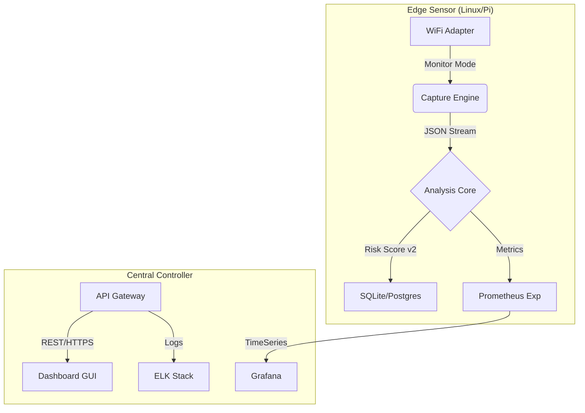

# Sentinel NetLab 🛡️
> **Enterprise-Grade Wireless Intrusion Detection System (WIDS)**

[](https://github.com/sentinel-netlab/core)
[](LICENSE)
[]()
[](https://www.python.org/)

**Sentinel NetLab** is a **Lightweight Wireless Network Monitoring and Anomaly Detection System** designed to **automate and orchestrate** security assessment tasks. It serves as an operational layer above standard tools (like Tshark/Aircrack-ng), providing continuous monitoring, centralized logging, and risk scoring for SMEs and Research Labs.

> **Note:** This project does not aim to replace deep analysis tools like Wireshark, nor does it focus on breaking encryption. Its core value lies in **operational visibility** and **posture assessment**.

---

## 🚀 Key Objectives

- **Orchestration**: Automate the capture-analyze-alert loop 24/7 without human intervention.
- **Posture Assessment**: Detect misconfigurations (Shadow IT, Rogue APs) and behavioral anomalies.
- **Cost-Effective Visibility**: Provide WIDS capabilities for environments that cannot afford enterprise appliances.
- **Real-time Forensics**: Automated PCAP analysis and attack signature detection.
- **Scalable Architecture**: Support for distributed sensors with centralized aggregation (Prometheus/ELK stack ready).
- **Active Defense**: Deauthentication containment capabilities (controlled environment only).

---

## 📚 Documentation Center

### 🛠️ Technical Documentation
- **Detailed Architecture**: [See System Design & Flowchart](docs/SYSTEM_DESIGN.md)
- **Technical Report**: [IEEE Standard Report](docs/IEEE_Sentinel_NetLab_Report.md)
- **Defense Materials**: [Defense Script](docs/defense_script.md) & [Slides](docs/presentation_slides.md)

- **[API Reference](docs/api_reference.md)**: Full REST API documentation with Python examples.
- **[Risk Scoring Model](docs/technical_gap_analysis.md#1-risk-scoring-algorithm-improvements)**: Details on the v2 scoring algorithm and weight calibration.

### ⚙️ Operations & Deployment
- **[Deployment Guide](docs/lightweight_deployment.md)**: Installation on Debian/Docker/Raspberry Pi.
- **[OS Tuning Guide](docs/os_tuning_guide.md)**: Kernel and OS optimization for low-latency capture.
- **[Metrics & Monitoring](docs/metrics_guide.md)**: KPIs, Prometheus integration, and benchmarking.
- **[ROI Analysis](docs/roi_analysis.md)**: Business value and cost-benefit analysis.

### 📖 User Guides
- **[User Manual & Demo](docs/demo_runbook.md)**: Step-by-step usage guide.
- **[Artifact Checklist](docs/artifact_checklist.md)**: Deliverables for audit/review.

---

## 🏗️ System Architecture



---

## ⚡ Quick Start

### 1. Prerequisites
- Linux Environment (Debian 12 / Ubuntu 22.04 recommended)
- Wireless Adapter supporting Monitor Mode (Atheros AR9271, Realtek RTL8812AU)
- Python 3.9+

### 2. Installation
```bash
# Clone repository
git clone https://github.com/sentinel-netlab/core.git
cd core

# Install dependencies
pip install -r requirements.txt

# Run system optimization (Optional)
sudo bash scripts/setup_debian_minimal.sh
```

### 3. Launching the Sensor
```bash
# Start API Server with Gunicorn (Production)
cd sensor
gunicorn -c gunicorn_conf.py api_server:app
```

---

## 🛡️ Security & Compliance
This software is intended for **authorized security auditing and research purposes only**. Users are responsible for complying with all applicable local, state, and federal laws.
- See **[Legal Disclaimer](docs/legal_ethics.md)** for details.

---

## 🤝 Contributing
We welcome contributions! Please see our [Contributing Guide](CONTRIBUTING.md) for details on:
- Code of Conduct
- Pull Request Process
- Coding Standards (PEP 8)

---
**Sentinel NetLab** © 2024-2026. All Rights Reserved.
