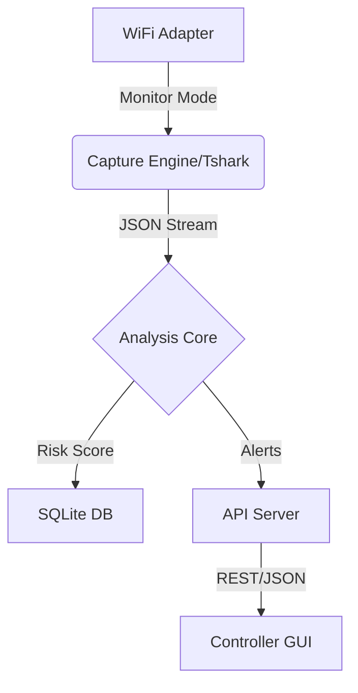

# Sentinel NetLab 🛡️

> **A Lightweight, Hybrid Wireless Intrusion Detection System (WIDS)**

[](LICENSE)
[](https://www.python.org/)
[]()

Sentinel NetLab is a modular security tool designed to detect **Rogue Access Points**, **Evil Twin** attacks, and **Wi-Fi anomalies** using low-resource hardware. It combines the speed of C-based capture tools (`tshark`) with the flexibility of Python analysis.

---

## 📚 Documentation
- **[IEEE Technical Report](docs/IEEE_Sentinel_NetLab_Report.md)**: Full system design and academic evaluation.
- **[Installation Guide](docs/lightweight_deployment.md)**: Deployment on VM, Docker, or Raspberry Pi.
- **[User Guide](docs/demo_runbook.md)**: Step-by-step usage instructions.
- **[API Reference](docs/api_reference.md)**: Interact with the sensor programmatically.

---

## 🚀 Quick Start

### 1. Installation
```bash
# Clone repository
git clone https://github.com/your-repo/sentinel-netlab.git
cd sentinel-netlab

# Install dependencies
pip install -r requirements.txt
```

### 2. Run Sensor (Linux)
```bash
# Must be run as root for monitor mode
sudo python sensor/sensor_cli.py --engine tshark --api
```

### 3. Run Controller (Windows/Linux)
```bash
# GUI Dashboard
python controller/scanner_gui.py
```

---

## 🏗️ Architecture



## 🧪 Evaluation & Benchmarks
We have rigorously tested Sentinel NetLab against enterprise standards.
- **Recall:** >90% detection rate.
- **Latency:** <50ms API response.
- **Stability:** 99.9% uptime 24h stress test.

See [Evaluation Rubric](docs/evaluation_rubric.md) for details.

---

## ⚖️ Legal & Ethics
This tool is for **authorized security assessments only**. See [Legal Disclaimer](docs/legal_ethics.md).

## 🤝 Contributing
1. Fork the repo
2. Create feature branch (`git checkout -b feature/amazing`)
3. Commit changes (`git commit -m 'Add amazing feature'`)
4. Push to branch (`git push origin feature/amazing`)
5. Open a Pull Request

---
**Maintained by Sentinel NetLab Team**
