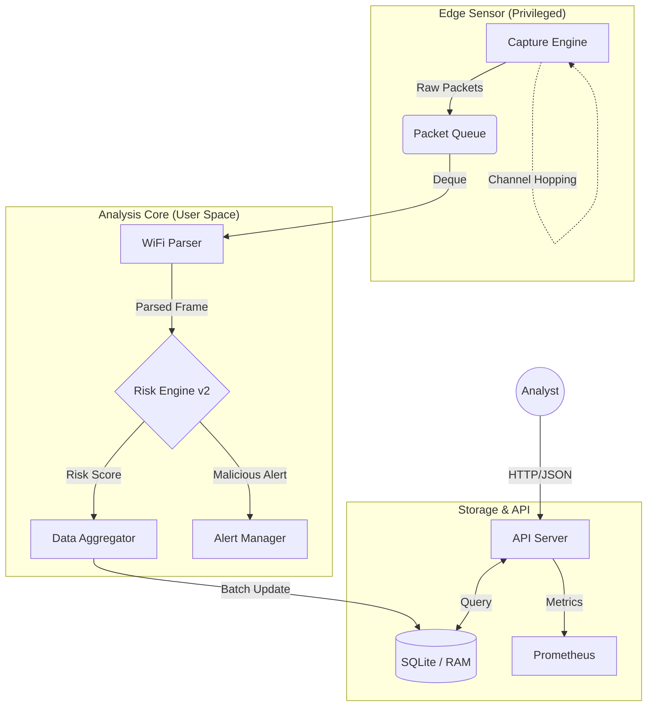

# System Architecture & Design

## 1. High-Level Data Flow

The Sentinel NetLab system operates on a **Producer-Consumer** model to ensure high-performance packet capture without blocking analysis logic.

## 2. Component Interaction

| Component | Responsibility | Key Technologies |
|-----------|----------------|------------------|
| **CaptureEngine** | Interfaces with Network Card (Monitor Mode), hops channels, pushes to Queue. | `Scapy` / `Tshark` / `Libpcap` |
| **WiFiParser** | Decodes 802.11 frames, extracts IE (Information Elements), standardizes BSSID/ESSID. | `Python struct` / `Scapy Layers` |
| **RiskEngine** | Calculates risk score based on weights (`risk_config.py`). Detects anomalies. | `Heuristic Logic` / `SciPy` (optional) |
| **API Server** | Exposes data to dashboard or external SIEM. Handles authentication. | `Flask` / `Gunicorn` |

## 3. Process Lifecycle

1. **Initialization**:
   - `CaptureEngine` starts background thread for Sniffing.
   - `CaptureEngine` starts background thread for Channel Hopping.
   - `API Server` starts and awaits requests.

2. **Packet Processing Loop**:
   - `while True: packet = queue.get()`
   - `parser.parse(packet)` -> `NetworkRecord`
   - `risk.calculate(record)` -> `RiskScore`
   - `storage.update(record, score)`

3. **Data Access**:
   - User requests `GET /api/v1/networks`.
   - Server returns JSON list of active networks with current Risk Levels.
