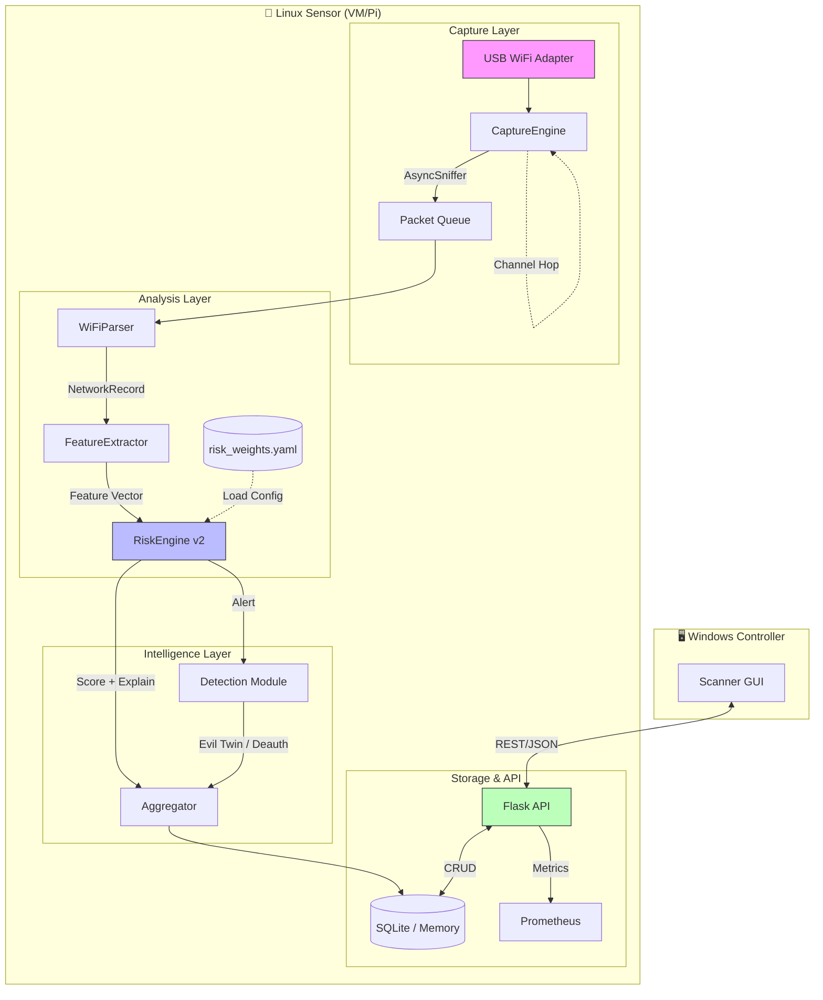
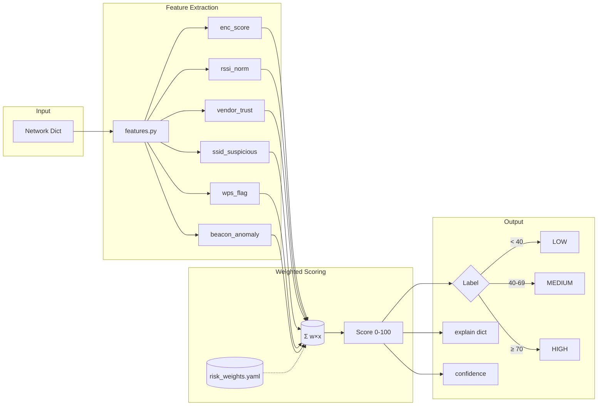
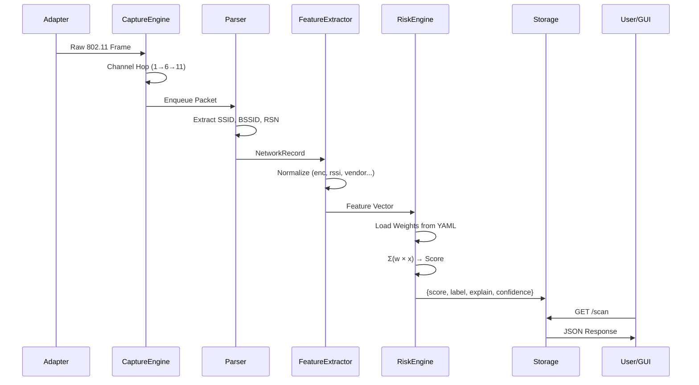
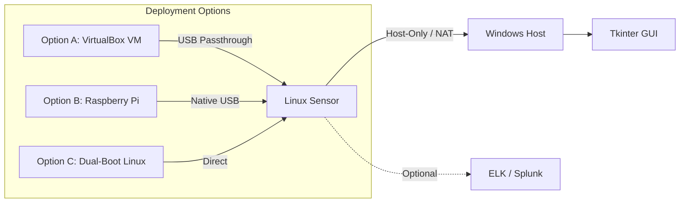

# System Architecture & Design

> Complete technical blueprint of Sentinel NetLab sensor architecture.

---

## 1. High-Level System Architecture



---

## 2. Risk Scoring Pipeline (Detail)



---

## 3. Component Reference

| Component | File | Responsibility |
|-----------|------|----------------|
| **CaptureEngine** | `capture.py` | Monitor mode, channel hopping, async sniffing |
| **WiFiParser** | `parser.py` | Decode 802.11, extract IEs (SSID, RSN, Vendor) |
| **FeatureExtractor** | `features.py` | Normalize raw data → float vector [0,1] |
| **RiskEngine** | `risk.py` | Load YAML weights, compute score, output explain |
| **Detection** | `detection.py` | Evil Twin (Levenshtein), Deauth Flood, Bloom Filter |
| **API Server** | `api_server.py` | REST endpoints, auth, rate limiting |
| **ML Classifier** | `models/ml_classifier.py` | Optional: LogisticRegression, train/predict |

---

## 4. Data Flow Sequence



---

## 5. Deployment Topology



---

## 6. File Structure

```
sensor/
├── api_server.py          # Flask REST API
├── capture.py             # Scapy capture engine
├── parser.py              # 802.11 frame parser
├── features.py            # Feature extraction (NEW)
├── risk.py                # Risk scoring engine (v2)
├── risk_weights.yaml      # External config (NEW)
├── detection.py           # Evil Twin / Deauth detection
├── storage.py             # SQLite + Memory storage
├── models/                # ML integration (NEW)
│   ├── __init__.py
│   └── ml_classifier.py
├── label_tool.py          # SOC labeling CLI (NEW)
└── monitoring.py          # Prometheus metrics
```

---

*Last Updated: January 27, 2026*
