# System Architecture & Design

> Complete technical blueprint of Sentinel NetLab sensor architecture.

---

## 1. High-Level System Architecture


---

## 2. Risk Scoring Pipeline (Detail)

```mermaid
flowchart LR
    subgraph Input
        NET[Network Dict]
    end
    
    subgraph "Feature Extraction"
        NET --> FE[features.py]
        FE --> ENC[enc_score]
        FE --> RSSI[rssi_norm]
        FE --> VEND[vendor_trust]
        FE --> SSID[ssid_suspicious]
        FE --> WPS[wps_flag]
        FE --> BCN[beacon_anomaly]
    end
    
    subgraph "Weighted Scoring"
        ENC & RSSI & VEND & SSID & WPS & BCN --> MUL[("Σ w×x")]
        YAML2[(risk_weights.yaml)] -.-> MUL
        MUL --> SCORE["Score 0-100"]
    end
    
    subgraph Output
        SCORE --> LBL{Label}
        LBL -->|< 40| LOW[LOW]
        LBL -->|40-69| MED[MEDIUM]
        LBL -->|≥ 70| HIGH[HIGH]
        SCORE --> EXP[explain dict]
        SCORE --> CONF[confidence]
    end
```



---

## 3. Component Reference

| Component | File | Responsibility |
|-----------|------|----------------|
| **CaptureEngine** | `capture.py` | Monitor mode, channel hopping, async sniffing |
| **WiFiParser** | `parser.py` | Decode 802.11, extract IEs (SSID, RSN, Vendor) |
| **FeatureExtractor** | `features.py` | Normalize raw data → float vector [0,1] |
| **RiskEngine** | `risk.py` | Load YAML weights, compute score, output explain |
| **Detection** | `detection.py` | Evil Twin (Levenshtein), Deauth Flood, Bloom Filter |
| **API Server** | `api_server.py` | REST endpoints, auth, rate limiting |
| **ML Classifier** | `models/ml_classifier.py` | Optional: LogisticRegression, train/predict |

---

## 4. Data Flow Sequence

```mermaid
sequenceDiagram
    participant A as Adapter
    participant C as CaptureEngine
    participant P as Parser
    participant F as FeatureExtractor
    participant R as RiskEngine
    participant S as Storage
    participant U as User/GUI

    A->>C: Raw 802.11 Frame
    C->>C: Channel Hop (1→6→11)
    C->>P: Enqueue Packet
    P->>P: Extract SSID, BSSID, RSN
    P->>F: NetworkRecord
    F->>F: Normalize (enc, rssi, vendor...)
    F->>R: Feature Vector
    R->>R: Load Weights from YAML
    R->>R: Σ(w × x) → Score
    R->>S: {score, label, explain, confidence}
    U->>S: GET /scan
    S->>U: JSON Response
```



---

## 5. Deployment Topology


---

## 6. File Structure

```
sensor/
├── api_server.py          # Flask REST API
├── capture.py             # Scapy capture engine
├── parser.py              # 802.11 frame parser
├── features.py            # Feature extraction (NEW)
├── risk.py                # Risk scoring engine (v2)
├── risk_weights.yaml      # External config (NEW)
├── detection.py           # Evil Twin / Deauth detection
├── storage.py             # SQLite + Memory storage
├── models/                # ML integration (NEW)
│   ├── __init__.py
│   └── ml_classifier.py
├── label_tool.py          # SOC labeling CLI (NEW)
└── monitoring.py          # Prometheus metrics
```

---

*Last Updated: January 27, 2026*
