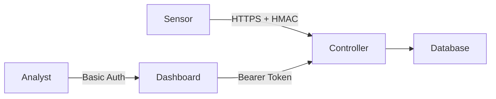

# Sentinel NetLab Threat Model

This document outlines the security threat model for Sentinel NetLab, a Wireless Intrusion Detection System (WIDS).

## 1. System Overview

Sentinel NetLab consists of:

| Component | Function | Trust Level |
|-----------|----------|-------------|
| **Sensor** | Passive WiFi capture, local analysis | High (runs as root) |
| **Controller** | Centralized API, data aggregation, token management | Critical |
| **Dashboard** | Analyst UI, visualization | Medium |
| **Database** | PostgreSQL + TimescaleDB for telemetry/alerts | Critical |



## 2. Assets

| Asset | Sensitivity | Description |
|-------|-------------|-------------|
| Telemetry Data | Medium | BSSID, SSID, RSSI, GPS coordinates |
| Alert Data | High | Security alerts with evidence payloads |
| API Tokens | Critical | Bearer tokens for sensor/dashboard auth |
| HMAC Secret | Critical | Shared secret for message signing |
| PCAP Files | High | Raw packet captures (potential PII) |

## 3. Threat Actors

| Actor | Motivation | Capability |
|-------|------------|------------|
| **External Attacker** | Data exfiltration, system disruption | Network access, basic exploitation |
| **Malicious Insider** | Sabotage, data theft | Authenticated access, system knowledge |
| **Adjacent Attacker** | WiFi-based attacks | Physical proximity, radio equipment |

## 4. Attack Vectors & Mitigations

### 4.1 Network Layer

| Threat | Vector | Impact | Mitigation | Status |
|--------|--------|--------|------------|--------|
| **Man-in-the-Middle** | Intercept Sensor→Controller traffic | Data tampering | HMAC signing, TLS | ✅ Implemented |
| **Replay Attack** | Resend valid telemetry packets | False data injection | Timestamp validation, nonce/sequence | ✅ Implemented |
| **DoS via Flood** | Overwhelm Controller API | Service disruption | Rate limiting (Flask-Limiter) | ✅ Implemented |

### 4.2 Application Layer

| Threat | Vector | Impact | Mitigation | Status |
|--------|--------|--------|------------|--------|
| **Unauthorized API Access** | Guess/steal Bearer tokens | Data access | Token rotation, RBAC (Permission enum) | ✅ Implemented |
| **SQL Injection** | Malicious input to DB queries | Data breach | SQLAlchemy ORM, parameterized queries | ✅ Implemented |
| **Dashboard Hijacking** | Unauthenticated access | Information disclosure | Basic Auth on Dashboard | ✅ Implemented |

### 4.3 Infrastructure Layer

| Threat | Vector | Impact | Mitigation | Status |
|--------|--------|--------|------------|--------|
| **Container Escape** | Exploit Docker vulnerabilities | Host compromise | Minimal base images, non-root users | ⚠️ Partial |
| **Secrets Exposure** | Hardcoded credentials in code/logs | Credential leak | Environment variables, `.env` files | ✅ Implemented |
| **Dependency Vulnerabilities** | Outdated packages | RCE, data breach | `pip-audit` in CI, Dependabot | ✅ Implemented |

### 4.4 Wireless Layer (Adjacent Attacker)

| Threat | Vector | Impact | Mitigation | Status |
|--------|--------|--------|------------|--------|
| **Sensor Deauth** | Flood sensor with deauth frames | Detection disruption | Out of scope (hardware limitation) | ⚪ N/A |
| **Evil Twin on Sensor** | Lure sensor to rogue AP | Sensor compromise | Sensor runs offline, no egress WiFi | ✅ By Design |

## 5. Data Flow Security

```
Sensor                          Controller                      Dashboard
  │                                │                                │
  ├─[1] Capture WiFi Frames        │                                │
  │     (Monitor Mode)             │                                │
  ├─[2] Parse & Normalize          │                                │
  │                                │                                │
  ├─[3] Sign Payload (HMAC-SHA256) │                                │
  │     + Add X-Timestamp          │                                │
  │                                │                                │
  ├───────────────────────────────>│                                │
  │         POST /telemetry        │                                │
  │         [Bearer Token]         │                                │
  │                                │                                │
  │                                ├─[4] Validate Signature         │
  │                                ├─[5] Validate Token (RBAC)      │
  │                                ├─[6] Validate Timestamp Drift   │
  │                                ├─[7] Persist to PostgreSQL      │
  │                                │                                │
  │                                │<───────────────────────────────┤
  │                                │     GET /networks              │
  │                                │     [Bearer Token]             │
  │                                │                                │
  │                                ├─[8] Validate Dashboard Token   │
  │                                ├─────────────────────────────────>│
  │                                │     JSON Response              │
```

## 6. Security Controls Summary

| Control | Implementation | File(s) |
|---------|----------------|---------|
| Authentication | Bearer Tokens + HMAC | `api_server.py` |
| Authorization | Permission Enum (RBAC) | `api_server.py` |
| Rate Limiting | Flask-Limiter | `api_server.py` |
| Input Validation | Pydantic Models | `api_server.py`, `schema.py` |
| Secrets Management | Environment Variables | `.env.example`, `docker-compose.yml` |
| Logging | Structured JSON Logs | `api_server.py` |
| Dependency Scanning | `pip-audit`, `bandit` | `.github/workflows/ci.yml` |

## 7. Residual Risks

| Risk | Likelihood | Impact | Justification |
|------|------------|--------|---------------|
| Sensor compromise via physical access | Low | High | Requires physical access to sensor hardware |
| Database credential leak | Low | Critical | Mitigated by `.env` + Kubernetes Secrets |
| Zero-day in dependencies | Low | Variable | Mitigated by regular updates, pip-audit |

## 8. Recommendations

1. **Enable TLS Everywhere**: Set `REQUIRE_TLS=true` in production.
2. **Rotate Tokens Regularly**: Implement token expiration and rotation policy.
3. **Network Segmentation**: Isolate Controller from public internet; use VPN for sensors.
4. **Audit Logging**: Enable detailed audit logs for compliance (GDPR, etc.).
5. **Penetration Testing**: Conduct annual security assessments.

---

*Last Updated: 2026-01-29*
*Maintainer: Sentinel NetLab Security Team*
