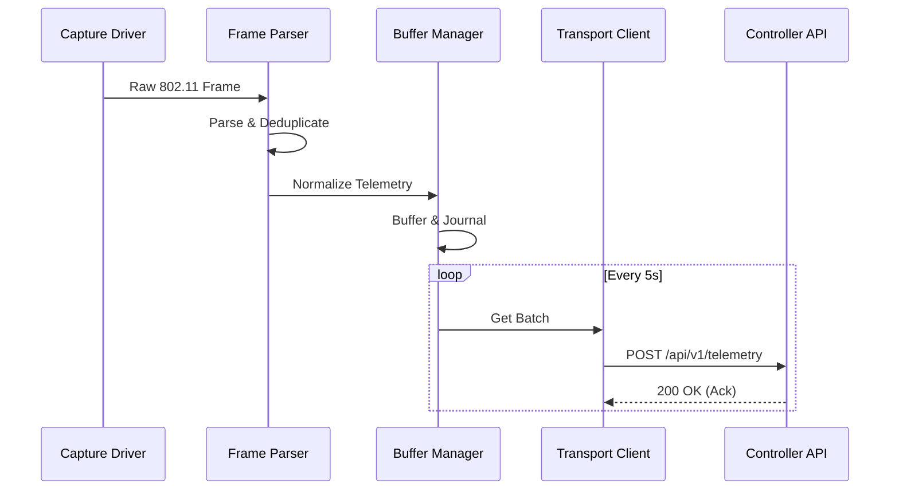

# System Architecture

## Overview
Sentinel NetLab is a distributed WiFi threat detection platform consisting of lightweight sensors and a central analysis controller.

## Components

### 1. Sensor (`sentinel-sensor`)
Runs on edge devices (Raspberry Pi, Linux laptops) to capture and analyze 802.11 management frames.

- **Capture Engine**: Uses `AsyncSniffer` (Scapy) to capture raw frames in monitor mode.
- **Frame Parser**: Extracts metadata (SSID, BSSID, RSSI, capabilities) from radiotap headers and 802.11 frames.
- **Normalizer**: Applies privacy filters (MAC anonymization) and schema normalization.
- **Buffer Manager**: In-memory ring buffer with disk journaling for offline resilience.
- **Transport Client**: Securely uploads batched telemetry to the controller with retry logic.

### 2. Controller (`api/`)
Centralized API for feature ingestion, analysis, and dashboarding.

- **Ingest API**: Accepts authenticated telemetry batches.
- **Analysis Engine**: Detects anomalies (Evil Twin, Rogue AP, Deauth Flood) using heuristic rules and ML models.
- **Storage**: Time-series database for metrics and relational DB for device inventory.

## Data Flow

## Security
- **Transport**: HTTPS with Mutual TLS (optional) or API Key + HMAC signature.
- **Privacy**: Configurable MAC anonymization (hashing) and SSID masking.
- **Edge**: Read-only file system support (optional) for sensor resilience.
