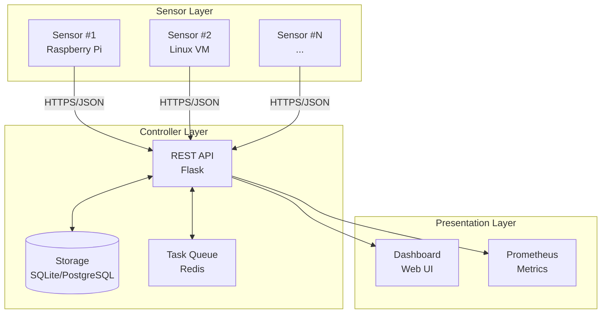
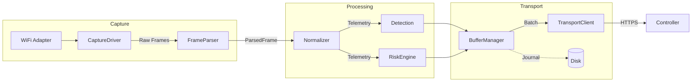
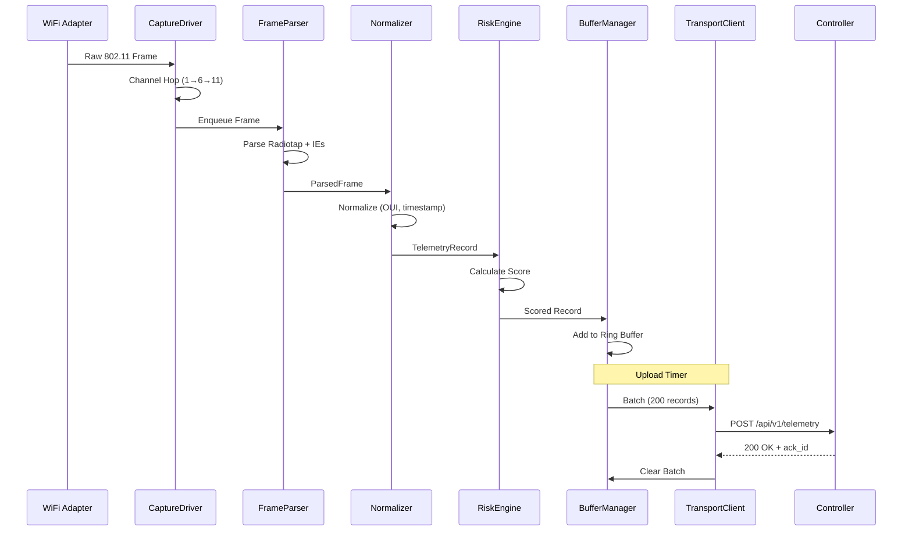
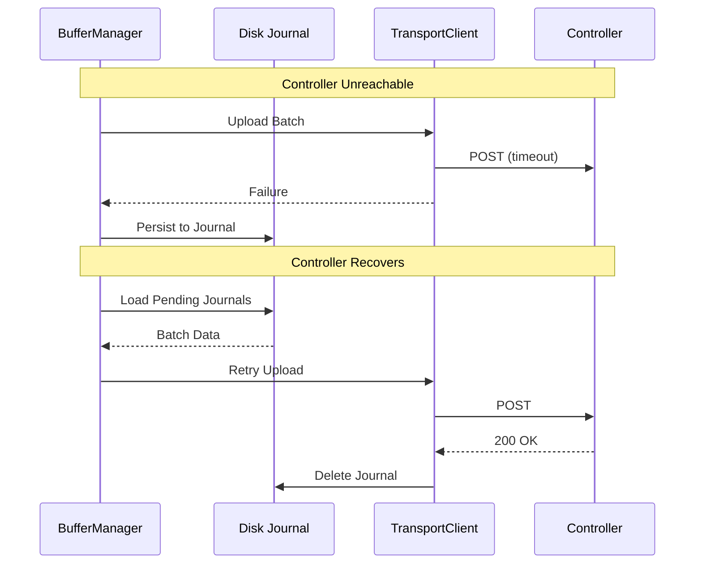
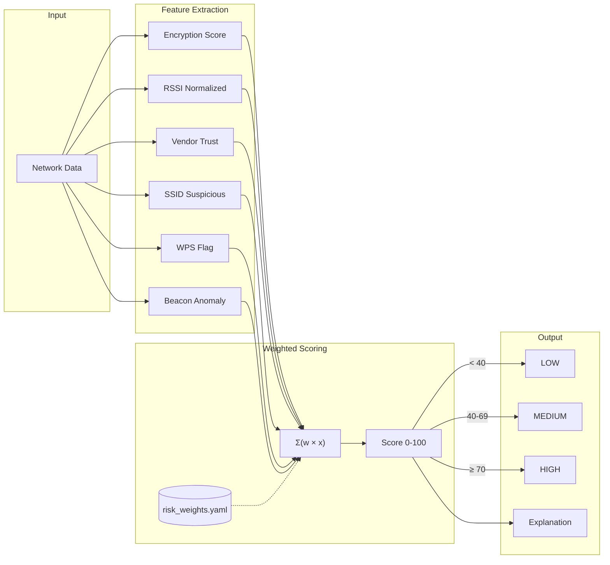
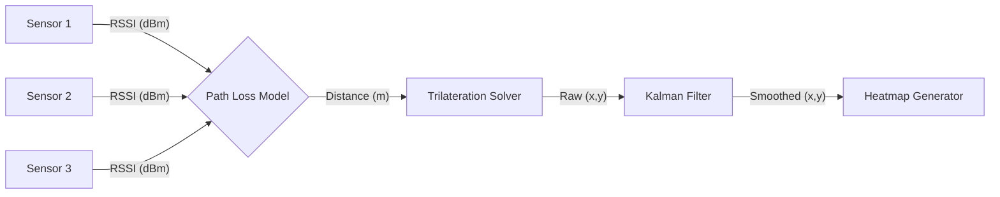
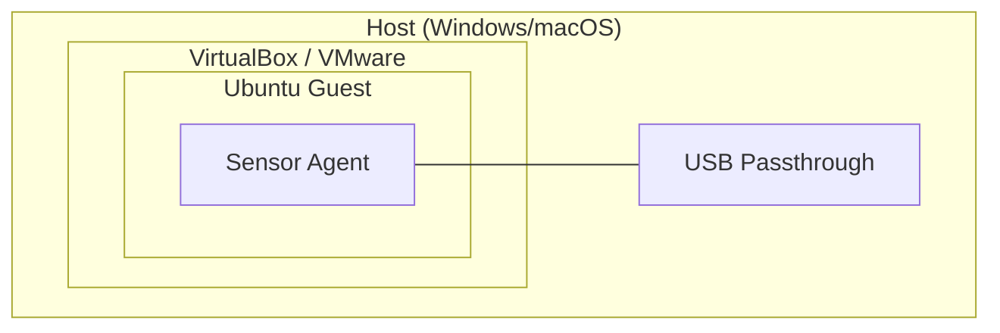

# System Architecture

Technical architecture and design documentation for Sentinel NetLab.

---

## High-Level Overview

Sentinel NetLab is a distributed wireless intrusion detection system with three primary layers:



---

## Sensor Architecture

Each sensor node runs independently and handles capture, processing, and upload.

### Component Diagram



### Component Responsibilities

| Component | File | Responsibility |
|-----------|------|----------------|
| **CaptureDriver** | `capture_driver.py` | Monitor mode, channel hopping, raw frame capture |
| **FrameParser** | `frame_parser.py` | Radiotap parsing, IE extraction, deduplication |
| **Normalizer** | `normalizer.py` | OUI lookup, timestamp normalization, anonymization |
| **RiskEngine** | `risk.py` | Weighted scoring, threat classification |
| **Detection** | `detection.py` | Evil twin, deauth flood, pattern matching |
| **BufferManager** | `buffer_manager.py` | Ring buffer, disk journal, batch selection |
| **TransportClient** | `transport_client.py` | Upload, retry, circuit breaker |
| **GeoMapper** | `geo_mapping.py` | Signal trilateration, Kalman filtering, heatmap generation |
| **Wardrive** | `wardrive.py` | GPS correlation, mobile capture, session management |
| **ActiveDefense** | `attacks.py` | Deauth, FakeAP (controlled lab use only) |
| **Audit** | `audit.py` | Security posture analysis, report generation |

---

## Data Flow

### Capture to Storage



### Network Outage Recovery



---

## Risk Scoring Pipeline



### Scoring Formula

```
Score = Σ (weight_i × feature_i) × 100

Where:
- feature_i ∈ [0, 1] (normalized)
- weight_i ∈ [0, 1] (from config)
- Σ weights = 1.0
```

---

## Detection Algorithms

### Evil Twin Detection

```python
# Simplified logic
def detect_evil_twin(current_ap, known_aps):
    for known in known_aps:
        if ssid_similarity(current_ap.ssid, known.ssid) > 0.8:
            if current_ap.bssid != known.bssid:
                if current_ap.rssi - known.rssi > 20:
                    return Alert("Evil Twin", severity="HIGH")
```

### Deauth Flood Detection

```python
# Sliding window rate detection
def detect_deauth_flood(frames, window_sec=2):
    deauth_count = count_frames(
        type="deauth", 
        window=window_sec
    )
    if deauth_count > threshold:
        return Alert("Deauth Flood", rate=deauth_count)
```

    if deauth_count > threshold:
        return Alert("Deauth Flood", rate=deauth_count)
```

### Geo-Location Engine (Trilateration)



### Active Defense Safety

The `ActiveDefense` module requires explicit safety overrides to operate (`ALLOW_ACTIVE_ATTACKS` env var). It provides:
- **Deauth**: Targeted disconnection of unauthorized clients.
- **FakeAP**: Honey-pot AP creation for detecting connection attempts.
- **Lab Safety**: Checks for isolated environment before execution.

---

## Deployment Options

### Option A: Raspberry Pi (Recommended)

```mermaid
graph TD
    subgraph "Raspberry Pi 4"
        Agent[Sensor Agent]
    end
    
    subgraph "Hardware"
        USB[USB WiFi<br/>(RTL8812AU)]
    end
    
    subgraph "Server"
        Ctrl[Controller]
    end

    Agent --- USB
    Agent -->|HTTP/S| Ctrl
```

### Option B: Virtual Machine



---

## JSON Schemas

All telemetry data conforms to JSON Schema (Draft-07):

- [telemetry.json](../../sensor/schema/telemetry.json) - Single record
- [telemetry_batch.json](../../sensor/schema/telemetry_batch.json) - Batch wrapper

---

## Technology Stack

| Layer | Technology |
|-------|------------|
| **Capture** | Scapy, libpcap, iw |
| **Processing** | Python 3.9+ |
| **API** | Flask, Gunicorn |
| **Storage** | SQLite, PostgreSQL (planned) |
| **Queue** | Redis (planned) |
| **Metrics** | Prometheus |
| **Containerization** | Docker (optional) |
