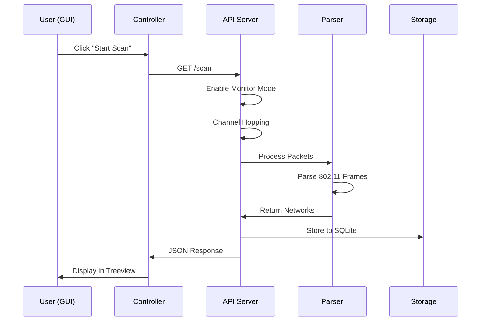

# Phân Tích Kiến Trúc - WiFi Security Assessment System

## 1. So sánh Phương án

| Tiêu chí | WSL2 | VirtualBox/VMware VM |
|----------|------|---------------------|
| Monitor Mode | ❌ Khó (cần custom kernel) | ✅ Dễ (native support) |
| USB Passthrough | 🟡 usbipd (phức tạp) | ✅ Native (đơn giản) |
| Driver Support | ❌ Hạn chế | ✅ Đầy đủ (Kali có sẵn) |
| Performance | ✅ Tốt | 🟡 Khá (VM overhead) |
| Setup Time | ❌ Lâu (build kernel) | ✅ Nhanh (import OVA) |
| Stability | ❌ Không ổn định | ✅ Ổn định |

**Kết luận:** Chọn **VirtualBox/VMware VM** cho độ ổn định và dễ triển khai.

---

## 2. Kiến Trúc Hệ Thống

```
┌─────────────────────────────────────────────────────────────────┐
│                     WINDOWS HOST                                 │
│                                                                  │
│  ┌────────────────────────┐        ┌───────────────────────────┐│
│  │     CONTROLLER         │  HTTP  │       LINUX VM            ││
│  │  ┌──────────────────┐  │  REST  │  ┌─────────────────────┐  ││
│  │  │  scanner_gui.py  │◄─┼────────┼─►│   api_server.py     │  ││
│  │  │                  │  │  :5000 │  │                     │  ││
│  │  │  - Tkinter UI    │  │        │  │  ┌───────────────┐  │  ││
│  │  │  - Risk Display  │  │        │  │  │  capture.py   │  │  ││
│  │  │  - Export        │  │        │  │  │  - Monitor    │  │  ││
│  │  └──────────────────┘  │        │  │  │  - Ch Hop     │  │  ││
│  │                        │        │  │  └───────┬───────┘  │  ││
│  │  ┌──────────────────┐  │        │  │          │          │  ││
│  │  │   api_client.py  │  │        │  │  ┌───────▼───────┐  │  ││
│  │  │   (planned)      │  │        │  │  │  parser.py    │  │  ││
│  │  └──────────────────┘  │        │  │  │  - 802.11     │  │  ││
│  └────────────────────────┘        │  │  │  - OUI        │  │  ││
│                                    │  │  └───────┬───────┘  │  ││
│                                    │  │          │          │  ││
│                                    │  │  ┌───────▼───────┐  │  ││
│                                    │  │  │  storage.py   │  │  ││
│                                    │  │  │  - SQLite     │  │  ││
│                                    │  │  │  - PCAP       │  │  ││
│                                    │  │  └───────────────┘  │  ││
│                                    │  │                     │  ││
│                                    │  │  ┌───────────────┐  │  ││
│                                    │  │  │  risk.py      │  │  ││
│                                    │  │  │  config.py    │  │  ││
│                                    │  │  └───────────────┘  │  ││
│                                    │  └─────────────────────┘  ││
│                                    │           │               ││
│                                    │    USB Passthrough        ││
│                                    │           │               ││
│                                    └───────────┼───────────────┘│
│                                                │                 │
│  ┌─────────────────────────────────────────────┴───────────────┐│
│  │                    USB WiFi Adapter                          ││
│  │                 (Atheros AR9271 - TL-WN722N v1)              ││
│  └──────────────────────────────────────────────────────────────┘│
└─────────────────────────────────────────────────────────────────┘
```

---

## 3. Data Flow



---

## 4. Bảo mật

| Layer | Mechanism |
|-------|-----------|
| Transport | HTTP (dev) / HTTPS (prod) |
| Authentication | X-API-Key header |
| Rate Limiting | 60 req/min |
| Input Validation | Flask validators |

---

## 5. Deployment Options

### Development
- VirtualBox NAT + Port Forwarding
- Flask debug mode

### Production
- VMware Bridged Network
- gunicorn + nginx
- TLS certificates
- systemd service

---

## 6. Files Reference

| File | Purpose |
|------|---------|
| `sensor/api_server.py` | Flask REST API |
| `sensor/capture.py` | Monitor mode, channel hopping |
| `sensor/parser.py` | 802.11 frame parsing |
| `sensor/storage.py` | SQLite, PCAP management |
| `sensor/risk.py` | Risk scoring algorithm |
| `sensor/config.py` | Configuration |
| `controller/scanner_gui.py` | Tkinter GUI |
