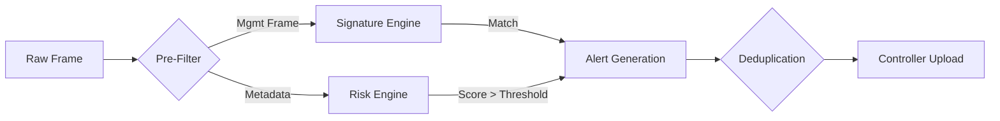

# Detection Philosophy

Sentinel NetLab utilizes a **hybrid detection strategy** combining signature-based rules for known threats with behavioral anomaly detection for novel attacks.

## 1. Hybrid Approach

### A. Rule-Based (Deterministic)
- **Target**: Known attack patterns defined by 802.11 standards violations or known tools (e.g., Aireplay-ng).
- **Pros**: Low false positives, high speed, explainable.
- **Cons**: Cannot detect new/modified attacks.
- **Implementation**: `algos.evil_twin`, `algos.dos`.

### B. Behavioral / Risk-Based (Heuristic)
- **Target**: Deviations from "normal" baseline behavior.
- **Pros**: Can detect zero-day or stealthy attacks (e.g., low-rate cloning).
- **Cons**: Higher false positive rate, requires tuning.
- **Implementation**: `algos.risk`.

## 2. Detection Pipeline

## 3. Tuning & Configuration
Detection sensitivity is configurable via `config/sensor.yaml`.
- `threshold_high`: Score > 90 (Immediate Critical Alert)
- `threshold_medium`: Score > 50 (Warning)
- `confirmation_window`: Time to wait for corroborating evidence (reduces flapping).
