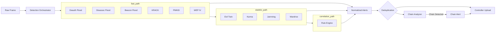

# Detection Philosophy

Sentinel NetLab utilizes a **hybrid detection strategy** combining signature-based rules for known threats with behavioral anomaly detection for novel attacks.

## 1. Active Detectors

### Signature / Rule-Based

| Detector | Module | Description |
|----------|--------|-------------|
| **Deauth Flood** | `algos.dos` | Sliding-window deauthentication frame rate analysis |
| **Disassoc Flood** | `algos.disassoc_detector` | Sliding-window disassociation frame rate analysis with multi-client severity |
| **Beacon Flood** | `algos.beacon_flood_detector` | Fake AP detection via unique SSID/BSSID counting (mdk3/mdk4) |
| **KRACK** | `algos.krack_detector` | Key Reinstallation Attack via EAPOL M3 replay detection (CVE-2017-13077) |
| **PMKID Harvesting** | `algos.pmkid_detector` | Dual-layer: Auth flood from random MACs + orphaned EAPOL M1 (hcxdumptool) |
| **WEP IV Attack** | `algos.wep_iv_detector` | IV collision and packet injection detection |
| **Evil Twin** | `algos.evil_twin` | Weighted risk scoring (RSSI, vendor, security, jitter) to detect rogue APs |

### Behavioral / Heuristic

| Detector | Module | Description |
|----------|--------|-------------|
| **Risk Scoring** | `algos.risk` | Configurable weighted risk engine with feature extraction |
| **RF Jamming** | `algos.jamming_detector` | Packet loss, RTS/CTS floods, anomalous RSSI |
| **Wardriving** | `algos.wardrive_detector` | Identifies mobile probe-request scanning patterns |
| **Karma/Pineapple** | `algos.karma_detector` | Detects APs responding to many unique SSIDs |

### Correlation

| Analyzer | Module | Description |
|----------|--------|-------------|
| **Rule Engine** | `sensor.rule_engine` | JSON-configurable rules with condition evaluation |
| **Exploit Chain** | `algos.exploit_chain_analyzer` | Links related detections into multi-stage attack chains |

## 2. Staged Detection Pipeline

Sensor-side detection is managed by the **SensorDetectionOrchestrator** (`sensor/detection/orchestrator.py`). Detectors are wrapped by adapters, registered in a central registry, and organized into execution stages.


```mermaid
graph LR
    Frame[Raw Frame] --> Orch[Detection Orchestrator]

    subgraph fast_path
        Deauth[Deauth Flood]
        Disassoc[Disassoc Flood]
        Beacon[Beacon Flood]
        KRACK[KRACK]
        PMKID[PMKID]
        WEP[WEP IV]
    end

    subgraph stateful_path
        ET[Evil Twin]
        Karma[Karma]
        Jam[Jamming]
        WD[Wardrive]
    end

    subgraph correlation_path
        Rules[Rule Engine]
    end

    Orch --> fast_path --> stateful_path --> correlation_path

    fast_path --> Alert[Normalized Alerts]
    stateful_path --> Alert
    correlation_path --> Alert

    Alert --> Dedupe{Deduplication}
    Dedupe --> Chain[Chain Analyzer]
    Chain -->|Chain Detected| ChainAlert[Chain Alert]
    Dedupe --> Upload[Controller Upload]
    ChainAlert --> Upload
```

## 3. Detector Profiles

| Profile | Detectors | Use Case |
|---------|-----------|----------|
| `lite_realtime` (default) | deauth, disassoc, beacon, KRACK, PMKID, WEP, rules | Real-time deployment, low FP |
| `full_wids` | All 11 detectors | Comprehensive monitoring |
| `audit_offline` | All 11 detectors | Offline replay analysis |

Select via: `--detector-profile`, `SENSOR_DETECTOR_PROFILE` env var, or config file.

## 4. Adding a New Detector

See [Developer Guide](../dev_detectors.md) for the step-by-step process. No edits to `sensor_controller.py` are needed — just create an adapter, register it, and add to profiles.

## 5. Tuning & Configuration

Detection sensitivity is configurable via the `detectors` config section:

```json
{
  "detectors": {
    "default_profile": "lite_realtime",
    "thresholds": {
      "deauth_flood": {"threshold_per_sec": 15.0}
    }
  }
}
```
