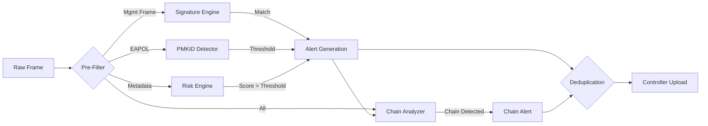

# Detection Philosophy

Sentinel NetLab utilizes a **hybrid detection strategy** combining signature-based rules for known threats with behavioral anomaly detection for novel attacks.

## 1. Active Detectors

### Signature / Rule-Based

| Detector | Module | Description |
|----------|--------|-------------|
| **Evil Twin** | `algos.evil_twin` | Weighted risk scoring (RSSI, vendor, security, jitter) to detect rogue APs |
| **Deauth Flood** | `algos.dos` | Sliding-window deauthentication frame rate analysis |
| **Karma/Pineapple** | `algos.karma_detector` | Detects APs responding to many unique SSIDs |
| **PMKID Harvesting** | `algos.pmkid_detector` | Dual-layer: Auth flood from random MACs + orphaned EAPOL M1 (hcxdumptool) |
| **WEP IV Attack** | `algos.wep_iv_detector` | IV collision and packet injection detection |

### Behavioral / Heuristic

| Detector | Module | Description |
|----------|--------|-------------|
| **Risk Scoring** | `algos.risk` | Configurable weighted risk engine with feature extraction |
| **RF Jamming** | `algos.jamming_detector` | Packet loss, RTS/CTS floods, anomalous RSSI |
| **Wardriving** | `algos.wardrive_detector` | Identifies mobile probe-request scanning patterns |

### Correlation

| Analyzer | Module | Description |
|----------|--------|-------------|
| **Exploit Chain** | `algos.exploit_chain_analyzer` | Links related detections into multi-stage attack chains |

## 2. Detection Pipeline

## 3. Tuning & Configuration
Detection sensitivity is configurable via `config/sensor.yaml`.
- `threshold_high`: Score > 90 (Immediate Critical Alert)
- `threshold_medium`: Score > 50 (Warning)
- `confirmation_window`: Time to wait for corroborating evidence (reduces flapping).
