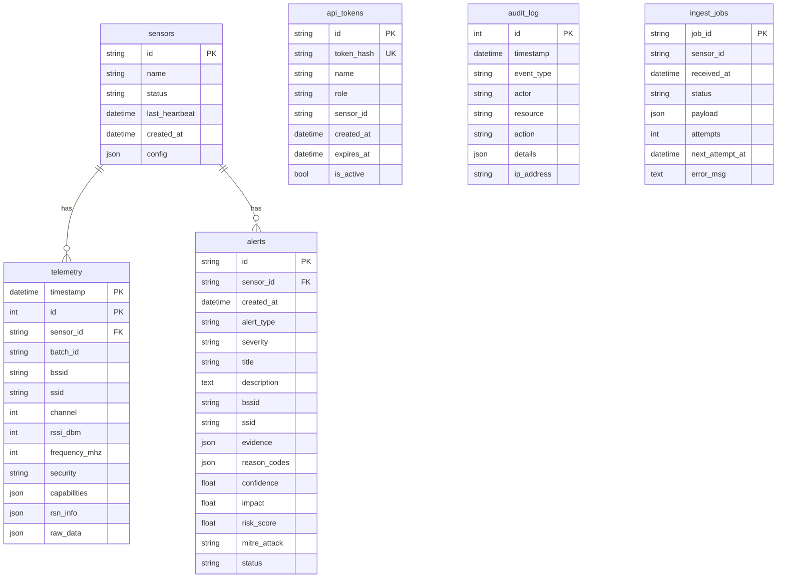

# Database Schema Reference

> **Generated from `controller/models.py` - Source of truth for schema.**

---

## Entity Relationship Diagram

---

## Table Details

### `sensors`

| Column | Type | Constraints | Description |
|--------|------|-------------|-------------|
| `id` | VARCHAR(64) | PRIMARY KEY | Unique sensor identifier |
| `name` | VARCHAR(128) | | Human-readable name |
| `status` | VARCHAR(20) | DEFAULT 'offline' | online/offline/stale |
| `last_heartbeat` | TIMESTAMPTZ | | Last health ping |
| `created_at` | TIMESTAMPTZ | | Registration time |
| `config` | JSON | | Sensor configuration |

---

### `telemetry`

**TimescaleDB Hypertable** (production only)

| Column | Type | Constraints | Description |
|--------|------|-------------|-------------|
| `timestamp` | TIMESTAMPTZ | PRIMARY KEY | Frame timestamp |
| `id` | INTEGER | PRIMARY KEY, AUTO | Row ID |
| `sensor_id` | VARCHAR(64) | FOREIGN KEY | Source sensor |
| `batch_id` | VARCHAR(64) | INDEX | Ingest batch |
| `bssid` | VARCHAR(17) | INDEX | AP MAC address |
| `ssid` | VARCHAR(32) | | Network name |
| `channel` | INTEGER | | WiFi channel |
| `rssi_dbm` | INTEGER | | Signal strength |
| `frequency_mhz` | INTEGER | | RF frequency |
| `security` | VARCHAR(20) | | WPA2/WPA3/OPEN |
| `capabilities` | JSON | | IE capabilities |
| `rsn_info` | JSON | | RSN IE data |
| `raw_data` | JSON | | Full frame data |

**Indexes:**
- `ix_telemetry_bssid_timestamp` (bssid, timestamp)

---

### `alerts`

| Column | Type | Constraints | Description |
|--------|------|-------------|-------------|
| `id` | VARCHAR(32) | PRIMARY KEY | Alert ID (e.g., ET-20260206-0001) |
| `sensor_id` | VARCHAR(64) | FOREIGN KEY, INDEX | Detecting sensor |
| `created_at` | TIMESTAMPTZ | INDEX | Alert timestamp |
| `alert_type` | VARCHAR(50) | INDEX | evil_twin/deauth_flood/karma |
| `severity` | VARCHAR(20) | INDEX | CRITICAL/HIGH/MEDIUM/LOW |
| `title` | VARCHAR(200) | | Short summary |
| `description` | TEXT | | Full details |
| `bssid` | VARCHAR(17) | | Target AP |
| `ssid` | VARCHAR(32) | | Target network |
| `evidence` | JSON | | Detection evidence |
| `reason_codes` | JSON | | Human-readable codes |
| `confidence` | FLOAT | | 0.0 - 1.0 |
| `impact` | FLOAT | | 0.0 - 100.0 |
| `risk_score` | FLOAT | | 0.0 - 100.0 |
| `mitre_attack` | VARCHAR(20) | | ATT&CK ID |
| `status` | VARCHAR(20) | INDEX, DEFAULT 'open' | open/resolved/dismissed |
| `resolved_at` | TIMESTAMPTZ | | Resolution time |
| `resolved_by` | VARCHAR(64) | | Resolver user |

---

### `api_tokens`

| Column | Type | Constraints | Description |
|--------|------|-------------|-------------|
| `id` | VARCHAR(32) | PRIMARY KEY | Token ID |
| `token_hash` | VARCHAR(64) | UNIQUE, INDEX | SHA-256 hash |
| `name` | VARCHAR(128) | | Description |
| `role` | VARCHAR(20) | | admin/sensor/readonly |
| `sensor_id` | VARCHAR(64) | NULLABLE | Bound sensor (if any) |
| `created_at` | TIMESTAMPTZ | | Creation time |
| `expires_at` | TIMESTAMPTZ | | Expiration |
| `last_used` | TIMESTAMPTZ | | Last API call |
| `last_sequence` | BIGINT | | Replay protection |
| `is_active` | BOOLEAN | DEFAULT true | Enabled |

---

### `audit_log`

| Column | Type | Constraints | Description |
|--------|------|-------------|-------------|
| `id` | INTEGER | PRIMARY KEY, AUTO | Row ID |
| `timestamp` | TIMESTAMPTZ | INDEX | Event time |
| `event_type` | VARCHAR(50) | INDEX | login/api_call/config_change |
| `actor` | VARCHAR(64) | | User/token ID |
| `resource` | VARCHAR(128) | | Target resource |
| `action` | VARCHAR(50) | | Action taken |
| `details` | JSON | | Extra context |
| `ip_address` | VARCHAR(45) | | Client IP |

---

### `ingest_jobs`

| Column | Type | Constraints | Description |
|--------|------|-------------|-------------|
| `job_id` | VARCHAR(64) | PRIMARY KEY | Job ID |
| `sensor_id` | VARCHAR(64) | NOT NULL | Source sensor |
| `received_at` | TIMESTAMPTZ | INDEX | Queue time |
| `status` | VARCHAR(20) | INDEX, DEFAULT 'queued' | queued/processing/done/failed |
| `payload` | JSON | | Telemetry batch |
| `attempts` | INTEGER | DEFAULT 0 | Retry count |
| `next_attempt_at` | TIMESTAMPTZ | | Next retry |
| `error_msg` | TEXT | | Last error |

**Indexes:**
- `idx_jobs_status_next` (status, next_attempt_at)
