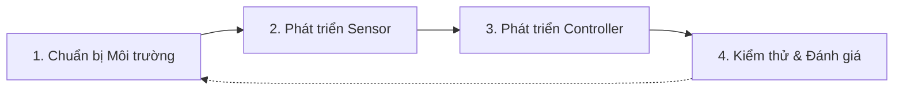
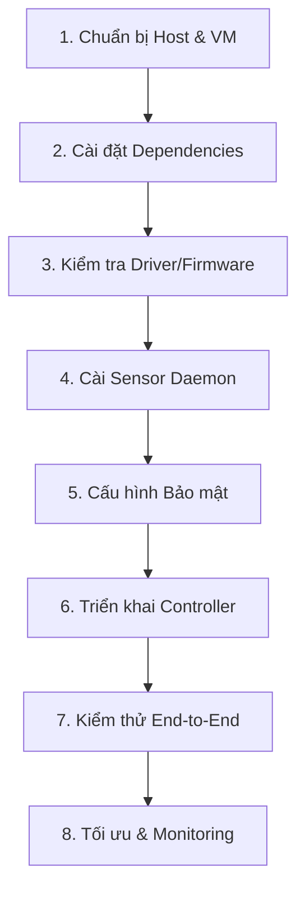
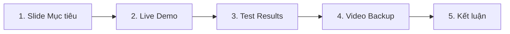

# BÁO CÁO KỸ THUẬT

## **Nghiên cứu và Phát triển Hệ thống Đánh giá An ninh Mạng Không dây Lai**
### Triển khai trên Linux VM với USB Passthrough cho Mục tiêu Pentest & Forensics

---

## Tóm tắt (Abstract)

Báo cáo trình bày quá trình nghiên cứu, thiết kế và triển khai một **Proof-of-Concept (PoC)** hệ thống đánh giá an ninh mạng không dây lai: **controller** chạy trên Windows (GUI thân thiện) và **sensor** chạy trên Linux VM sử dụng USB passthrough để tiếp cận card Wi-Fi ở chế độ monitor. 

Hệ thống cung cấp khả năng:
- Quét beacon/probe frames
- Channel-hopping
- Phân tích metadata (SSID/BSSID/RSSI/Encryption)
- Tính điểm rủi ro (Risk Scoring)
- Lưu trữ lịch sử (SQLite)
- Xuất báo cáo forensics (CSV/JSON)

Báo cáo nêu rõ kiến trúc, chi tiết triển khai kỹ thuật, kế hoạch 8 tuần MVP, kết quả thử nghiệm, rủi ro và hướng phát triển.

**Từ khóa:** monitor mode, USB passthrough, Linux VM, Wi-Fi reconnaissance, Scapy, Flask, risk scoring, forensics.

---

## Mục lục

1. [Giới thiệu](#1-giới-thiệu)
2. [Bối cảnh và Động cơ](#2-bối-cảnh-và-động-cơ)
3. [Vấn đề Nghiên cứu](#3-vấn-đề-nghiên-cứu)
4. [Mục tiêu Đề tài](#4-mục-tiêu-đề-tài)
5. [Phương pháp Thực hiện](#5-phương-pháp-thực-hiện)
6. [Kiến trúc Hệ thống](#6-kiến-trúc-hệ-thống)
7. [Triển khai Kỹ thuật (Chi tiết)](#7-triển-khai-kỹ-thuật)
8. [Kịch bản Thử nghiệm & Tiêu chí Đánh giá](#8-kịch-bản-thử-nghiệm)
9. [Kết quả Mong đợi & Minh chứng](#9-kết-quả-mong-đợi)
10. [Rủi ro, Giới hạn và Giải pháp](#10-rủi-ro-và-giới-hạn)
11. [Lộ trình 8 Tuần (MVP)](#11-lộ-trình-8-tuần)
12. [Sản phẩm Đầu ra](#12-sản-phẩm-đầu-ra)
13. [Kết luận và Hướng Phát triển](#13-kết-luận)
14. [Phụ lục](#14-phụ-lục)

---

## 1. Giới thiệu

Sự phát triển mạnh mẽ của các mạng không dây (Wi-Fi) trong hạ tầng doanh nghiệp, cơ quan và đời sống cá nhân khiến việc đánh giá, giám sát và bảo vệ bề mặt tấn công không dây trở thành một yêu cầu cấp thiết trong lĩnh vực an ninh mạng. 

Các kỹ thuật thu thập thông tin tại tầng liên kết (link-layer) như bắt các frame 802.11 (beacon, probe, management) là bước tiền đề cho các hoạt động:
- **Reconnaissance** (Thu thập thông tin)
- **Forensics** (Điều tra số)
- **Đánh giá rủi ro** (Risk Assessment)

Tuy nhiên, môi trường thực tế nơi đa số thiết bị đầu cuối đang chạy Windows làm phát sinh bất tiện: nhiều công cụ mạnh mẽ để thu thập và phân tích gói tin ở tầng 2 (ví dụ: `aircrack-ng`, `Scapy`, `tshark` ở chế độ monitor) được thiết kế tối ưu cho nền tảng Linux.

Báo cáo này trình bày nghiên cứu và triển khai một **Proof-of-Concept (PoC)** cho hệ thống **Đánh giá An ninh Mạng Không dây Lai** (Hybrid Wireless Security Assessment System). Hệ thống kết hợp hai thành phần chính:

| Thành phần | Nền tảng | Chức năng |
|------------|----------|-----------|
| **Sensor** | Linux VM (Kali) | Thao tác phần cứng Wi-Fi ở chế độ monitor, bắt và phân tích frame |
| **Controller** | Windows | Giao diện thân thiện, trực quan cho người dùng |

Mục tiêu của đề tài là tạo ra một sản phẩm thực chiến, có thể demo trong môi trường lab, hỗ trợ pentest, đào tạo Blue Team và forensic cho các trường hợp mạng không dây.

---

## 2. Bối cảnh và Động cơ

### 2.1 Thực trạng

Hầu hết môi trường doanh nghiệp và tổ chức hiện nay sử dụng máy trạm chạy hệ điều hành Windows (ước tính chiếm tỷ lệ lớn trong thị trường desktop). Trong khi đó, các công cụ mạnh mẽ và phổ biến nhất để phân tích, kiểm thử và khai thác lỗ hổng tại tầng không dây — bao gồm khả năng đặt card ở monitor mode và thực hiện packet injection — được phát triển và tối ưu trên nền tảng Linux. 

**Sự không tương thích này tạo ra một khoảng cách** giữa nhu cầu thực tế của chuyên gia an ninh (cần làm việc nhanh, trực tiếp trên máy Windows) và khả năng kỹ thuật để thu thập dữ liệu link-layer đầy đủ.

Các giải pháp hiện có đều tồn tại hạn chế:

| Giải pháp | Hạn chế |
|-----------|---------|
| **Dual-boot** | Gián đoạn công việc, không thuận tiện cho demo |
| **Máy ảo truyền thống** | Nặng nề, USB passthrough không đúng cách |
| **Thiết bị chuyên dụng** | Chi phí cao (>$1000), không phù hợp quy mô sinh viên |
| **WSL2** | Giới hạn driver Wi-Fi, raw 802.11 frame capture không ổn định |

### 2.2 Cơ hội từ Công nghệ

Công nghệ ảo hóa và cơ chế **USB passthrough** (hỗ trợ bởi VMware, VirtualBox hoặc usbipd-win) cung cấp phương án thực sự khả thi:
- Chạy **sensor trên Linux (VM)** với driver đầy đủ để điều khiển adapter Wi-Fi ở chế độ monitor.
- Đồng thời giữ **controller trên Windows** nhằm cung cấp trải nghiệm người dùng dễ tiếp cận.

Các adapter dựa trên chip **Atheros AR9271** (ví dụ: TP-Link TL-WN722N v1) được cộng đồng chứng minh là tương thích tốt với monitor/injection trên Linux, giúp giảm rủi ro kỹ thuật khi triển khai.

### 2.3 Động cơ Nghiên cứu

Đề tài khởi xướng từ nhu cầu thực tế và **động cơ kép**:

1. **Thực chiến**: Tạo ra một công cụ PoC dễ reproducible để phục vụ pentest/forensics/đào tạo.
2. **Đóng góp**: Cung cấp hướng tiếp cận thực tế cho các đội ngũ an ninh làm việc chủ yếu trên Windows nhưng cần khả năng phân tích Wi-Fi ở mức độ sâu.

Việc phát triển một hệ thống lai còn cho phép nghiên cứu thêm về:
- Đồng bộ dữ liệu giữa sensor và controller
- Risk scoring cho Access Points
- Lưu trữ forensics (pcap rotation)
- Tích hợp kết quả với SIEM/ELK để phân tích dài hạn

### 2.4 Ý nghĩa và Lợi ích

| Lĩnh vực | Lợi ích |
|----------|---------|
| **Thực chiến** | Hỗ trợ pentester và SOC xác định bề mặt tấn công không dây, phát hiện AP yếu, AP mở, hoặc Evil-Twin |
| **Giáo dục & Đào tạo** | Lab thực hành cho sinh viên học về monitor mode, packet parsing, forensic workflows mà không cần thiết bị đắt tiền |
| **Tiết kiệm Chi phí** | Sử dụng USB Wi-Fi adapter giá rẻ (~$15) và VM cho phép nhân rộng môi trường thử nghiệm |
| **Nghiên cứu Mở rộng** | Cơ sở phát triển các module như anomaly detection, fingerprinting, tích hợp MITRE ATT&CK |

### 2.5 Lưu ý Pháp lý và Đạo đức

> [!CAUTION]
> Môi trường sniffing và các hoạt động liên quan đến thu thập gói tin không dây có thể chồng lấn ranh giới pháp lý và đạo đức nếu thực hiện trên mạng không thuộc quyền quản lý.

**Nguyên tắc tuân thủ của dự án:**
- Mọi hoạt động tấn công (injection, deauth) đều **bị vô hiệu hóa theo mặc định**.
- Chỉ được kích hoạt trong **môi trường lab có sự cho phép rõ ràng**.
- Báo cáo nêu rõ các ràng buộc pháp lý, quy trình xin phép và biện pháp bảo mật dữ liệu.

**Khuyến nghị:**
1. Chỉ thực hiện trên mạng bạn sở hữu hoặc có văn bản cho phép.
2. Không lưu trữ dữ liệu cá nhân từ các probe request.
3. Tuân thủ luật an ninh mạng tại địa phương (ví dụ: Luật An ninh mạng Việt Nam 2018).

---

## 3. Vấn đề Nghiên cứu

### 3.1 Vấn đề Tổng quát

Trong lĩnh vực an ninh mạng không dây, việc thu thập và phân tích dữ liệu ở **tầng liên kết (IEEE 802.11)** là bước nền tảng cho nhiều hoạt động quan trọng:

- **Reconnaissance** (Thu thập thông tin)
- **Đánh giá rủi ro** (Risk Assessment)
- **Phát hiện điểm truy cập yếu** (Weak AP Detection)
- **Điều tra sự cố** (Wireless Forensics)
- **Mô phỏng tấn công/phòng thủ** (Red/Blue Team Exercises)

Tuy nhiên, môi trường triển khai thực tế của phần lớn chuyên gia an ninh hiện nay vẫn là **Windows**, trong khi các kỹ thuật phân tích sâu ở tầng 2 lại phụ thuộc chặt chẽ vào **Linux** do yêu cầu:
- Monitor mode
- Raw frame access
- Khả năng tương tác trực tiếp với driver

> **Bài toán kỹ thuật cốt lõi:**
> Làm thế nào để duy trì trải nghiệm làm việc trên Windows, đồng thời vẫn khai thác được đầy đủ năng lực giám sát và phân tích Wi-Fi của Linux, mà không phải đánh đổi hiệu năng, độ ổn định hoặc chi phí?

### 3.2 Các Vấn đề Kỹ thuật Cụ thể

#### 3.2.1 Hạn chế của Windows trong Phân tích Mạng Không dây

| Hạn chế | Ảnh hưởng |
|---------|-----------|
| Không hỗ trợ **monitor mode** mặc định | Chỉ capture gói tin ở tầng IP (Layer 3+) |
| Frame quản lý Wi-Fi bị ẩn | Beacon, Probe Request/Response, Association không visible |
| Không thể packet injection | Không thực hiện được các kỹ thuật tấn công cơ bản |
| Không phân tích raw 802.11 frame | Mất thông tin metadata quan trọng |
| Công cụ thương mại đắt đỏ | Không phù hợp nghiên cứu học thuật |

#### 3.2.2 Hạn chế của Các Giải pháp Hiện có

| Giải pháp | Hạn chế chính |
|-----------|---------------|
| **Dual-boot** | Không linh hoạt, gián đoạn workflow, không demo-friendly |
| **Linux VM thông thường** | Phụ thuộc USB passthrough, cấu hình phức tạp |
| **WSL2** | Không hỗ trợ driver Wi-Fi monitor/injection ổn định |
| **Thiết bị chuyên dụng** | Chi phí cao (>$1000), khó mở rộng |

> [!IMPORTANT]
> **Về WSL2:** Qua quá trình thử nghiệm thực tế, WSL2 cho thấy **không đáp ứng được yêu cầu kỹ thuật cốt lõi** của đề tài do kernel giới hạn module mạng không dây, khiến các driver như `ath9k_htc` không thể hoạt động đầy đủ. Do đó, dự án chuyển sang sử dụng **Linux VM (VirtualBox/VMware)** thay thế.

#### 3.2.3 Vấn đề Tích hợp Hệ thống

Ngay cả khi sử dụng Linux native hoặc Linux VM để xử lý phần Wi-Fi, vẫn tồn tại các câu hỏi kỹ thuật chưa được giải quyết rõ ràng:

1. **Tách biệt phần cứng và phần mềm:**
   - Làm thế nào để tách biệt phần xử lý phần cứng (sensor) và phần điều khiển/hiển thị (controller)?

2. **Giao tiếp giữa hai môi trường:**
   - Giao tiếp dữ liệu giữa hai môi trường như thế nào để đảm bảo độ trễ thấp, ổn định và mở rộng được?

3. **Chuẩn hóa dữ liệu:**
   - Dữ liệu thu thập cần được chuẩn hóa ra sao để phục vụ phân tích bảo mật, forensic và tích hợp SIEM?

### 3.3 Câu hỏi Nghiên cứu (Research Questions)

Từ các vấn đề trên, đề tài tập trung trả lời các câu hỏi nghiên cứu sau:

| RQ | Câu hỏi | Mục tiêu |
|----|---------|----------|
| **RQ1** | Có thể xây dựng một hệ thống đánh giá an ninh mạng không dây dạng lai (hybrid), trong đó Linux đảm nhiệm sensor và Windows đảm nhiệm controller, mà vẫn đảm bảo hiệu năng và độ ổn định hay không? | Chứng minh tính khả thi |
| **RQ2** | Kiến trúc tách sensor–controller có đáp ứng được yêu cầu monitor mode, capture raw 802.11 frame và phân tích bảo mật trong môi trường thực tế không? | Đánh giá kỹ thuật |
| **RQ3** | Hệ thống đề xuất có thể đạt được mức độ phát hiện mạng và độ chính xác tiệm cận các công cụ chuẩn như `airodump-ng` hay không? | Benchmark hiệu năng |
| **RQ4** | Mô hình này có phù hợp để sử dụng trong pentest, đào tạo Blue Team và wireless forensic lab với chi phí thấp không? | Đánh giá ứng dụng thực tế |

## 4. Mục tiêu Đề tài

### 4.1 Mục tiêu Chung

Xây dựng và đánh giá một **Hệ thống Đánh giá An ninh Mạng Không dây Lai** (Hybrid Wireless Security Assessment System), trong đó:

| Thành phần | Nền tảng | Trách nhiệm |
|------------|----------|-------------|
| **Sensor** | Linux VM | Thao tác phần cứng Wi-Fi ở chế độ monitor, thu thập frame 802.11 |
| **Controller** | Windows | Giao diện trực quan, phân tích rủi ro, chức năng forensics |

> **Yêu cầu:** Hệ thống phải là một **Proof-of-Concept (PoC)** thực chiến, có thể demo, reproducible và phù hợp cho pentest/Blue Team/forensics trong môi trường lab.

### 4.2 Mục tiêu Kỹ thuật (Technical Objectives)

| # | Mục tiêu | Chi tiết | Tiêu chí Thành công |
|---|----------|----------|---------------------|
| **T1** | **Triển khai sensor ổn định trên Linux VM** | Sensor nhận USB Wi-Fi qua passthrough, load driver (`ath9k_htc`) và chuyển card sang monitor mode | `iw dev` hiển thị interface dạng monitor |
| **T2** | **Thu thập và phân tích gói tin 802.11** | Bắt Beacon/Probe/Management frames, parse ra SSID, BSSID, RSSI, channel, encryption | Độ chính xác 100% so với ground truth trong môi trường kiểm soát |
| **T3** | **Hỗ trợ channel-hopping & coverage** | Quét đa kênh (ít nhất kênh 1,6,11) với dwell time có thể cấu hình | Phát hiện ≥80% AP so với `airodump-ng` (same hardware) |
| **T4** | **Giao tiếp sensor ↔ controller an toàn** | API/Socket JSON qua TLS hoặc SSH tunnel, có cơ chế xác thực (API key) | RTT < 1 giây; scan 10s hiển thị trong < 5 giây |
| **T5** | **Lưu trữ & forensics** | Lưu metadata (first_seen, last_seen, counts) vào SQLite; lưu PCAP theo phiên | Truy xuất 50 bản ghi gần nhất; export PCAP/CSV/JSON hoạt động |
| **T6** | **Đánh giá rủi ro (risk scoring)** | Thuật toán weight-based phân loại AP thành High/Medium/Low | Score 0–100; High ↔ score ≥ 70 |

### 4.3 Mục tiêu Sản phẩm (Product Objectives)

```
📂 Sản phẩm Đầu ra
├── 📁 Source Code
│   ├── /sensor/        # Flask + Scapy backend
│   ├── /controller/    # Tkinter GUI
│   ├── /docs/          # Tài liệu
│   └── /tests/         # Unit tests
│
├── 📊 GUI Windows
│   ├── Start/Stop Scan
│   ├── Realtime List
│   ├── Filter & Search
│   └── Export (CSV/JSON)
│
├── 🛠️ Installer / Scripts
│   ├── setup_vm.sh     # Provision VM tự động
│   └── check_driver.py # Kiểm tra driver/firmware
│
└── 📖 Tài liệu
    ├── Hướng dẫn cài đặt
    ├── User Manual
    ├── Báo cáo kỹ thuật (30-40 trang)
    ├── Slide thuyết trình (15-20 slide)
    └── Video demo (3-5 phút)
```

### 4.4 Tiêu chí Đánh giá (Success Criteria)

| Tiêu chí | Cách đo | Ngưỡng Đạt |
|----------|---------|------------|
| **Phát hiện mạng (Recall)** | So sánh kết quả PoC vs `airodump-ng` | ≥ 80% AP được phát hiện |
| **Độ chính xác thông tin** | So sánh SSID/BSSID với ground truth | 100% chính xác (môi trường kiểm soát) |
| **Thời gian phản hồi API** | `time.time()` đo RTT | < 1 giây |
| **Thời gian hiển thị scan** | Từ kết thúc capture → GUI cập nhật | < 5 giây (scan mẫu 10s) |
| **Ổn định vận hành** | Chạy liên tục scan mỗi 2 phút trong 30 phút | 0 crash / 0 disconnect |
| **Tính khả dụng** | 3 người không chuyên cài theo hướng dẫn | ≥ 2/3 hoàn thành task cơ bản |
| **Chi phí phần cứng** | Tổng chi phí adapter + phụ kiện | ≤ 300.000 VND |

### 4.5 Phạm vi & Giới hạn

> [!NOTE]
> **Trong phạm vi (In-Scope):**
> - Reconnaissance, monitoring và forensic
> - Sensor trên Linux VM/physical Linux
> - MVP trong 8 tuần

> [!WARNING]
> **Ngoài phạm vi (Out-of-Scope):**
> - Chức năng tấn công (chỉ enable trong lab có phép)
> - WSL2 làm nền tảng chính (do hạn chế driver)
> - Tính năng nâng cao: multi-sensor, SIEM tích hợp sâu, ML detection (hướng mở rộng sau MVP)

---

## 5. Phương pháp Thực hiện

### 5.0 Tổng quan Phương pháp

**Mục tiêu:** Xây dựng PoC hệ thống hybrid (Windows controller + Linux VM sensor) để thu thập, phân tích và đánh giá rủi ro mạng Wi-Fi ở tầng 2 (802.11).

**4 lớp công việc chính:**



| Lớp | Nội dung |
|-----|----------|
| **1** | VM, USB passthrough, driver |
| **2** | Monitor control, channel-hopping, sniff, parse, persist |
| **3** | GUI, client API, hiển thị & export |
| **4** | Unit, tích hợp, hiệu năng, stability, usability, forensics |

> Mỗi lớp triển khai theo chu trình **Agile**: thiết kế → phát triển → kiểm thử nhanh → tích hợp → hoàn thiện.

---

### 5.1 Chuẩn bị Môi trường (Provisioning & Validation)

#### 5.1.1 Môi trường Phần cứng/Ảo hóa

| Thành phần | Yêu cầu |
|------------|---------|
| **Host** | Windows 10/11 (8GB RAM, 4 cores recommended) |
| **Hypervisor** | VirtualBox 7.x hoặc VMware Workstation (Extension Pack / VMware tools cho USB passthrough) |
| **USB Wi-Fi Adapter** | TP-Link TL-WN722N v1 (Atheros AR9271) hoặc Alfa AWUS036NHA |

#### 5.1.2 Cài đặt VM Kali/Ubuntu

```bash
# VM Configuration
- Import official Kali OVA hoặc tạo VM Ubuntu + Kali tools
- vCPU: 2 | RAM: 4GB | Disk: 30GB (tối thiểu)
- Enable USB passthrough, tạo USB filter cho adapter
```

#### 5.1.3 Kiểm tra Driver & Firmware

```bash
# Trong VM, chạy:
sudo apt update
sudo apt install -y firmware-atheros aircrack-ng iw tcpdump tshark python3-pip
lsusb
lsmod | grep ath9k_htc
ls /lib/firmware/ath9k_htc || echo "firmware missing"
dmesg | tail -n 50
```

> [!TIP]
> Nếu module chưa có, dùng image Kali chuẩn hoặc chuyển VM sang host khác. Nếu không thể load driver → dùng **fallback**: mock data / physical Linux.

**Sản phẩm:** VM hoạt động, adapter attach thành công, monitor mode khả dụng.

---

### 5.2 Phát triển Sensor (Linux VM)

#### 5.2.1 Kiến trúc Sensor

```
sensor.service (systemd)
    └── api_server.py (Python daemon)
        ├── Monitor Controller    # bật/tắt monitor, set channel
        ├── Channel Hopper        # vòng lặp đổi kênh với dwell time
        ├── Capture Engine        # Scapy / tshark (RadioTap parsing)
        ├── Parser                # SSID, BSSID, RSSI, encryption, channel, OUI
        ├── Persistence           # SQLite (networks, scans, pcaps metadata)
        └── API/Comm              # Flask REST (JSON) + API key
```

#### 5.2.2 Quy trình Kỹ thuật (Scan Loop)

```python
# Pseudocode
def scan_cycle(interface, channels, dwell):
    for ch in channels:
        ip_set_channel(interface, ch)
        pkts = sniff(iface=interface, timeout=dwell, lfilter=is_beacon_or_probe)
        for p in pkts:
            record = parse_packet(p)
            store_or_update(record)

# dwell khuyến nghị: 0.3–0.6s cho MVP (tùy density)
# Sniff: Scapy AsyncSniffer hoặc tshark -i wlan0 -a duration:... -T ek
```

#### 5.2.3 API & Security

| Endpoint | Chức năng |
|----------|-----------|
| `/health` | Kiểm tra status sensor |
| `/scan` | Thực hiện scan và trả kết quả |
| `/history` | Lấy lịch sử scan |
| `/export/csv` | Xuất dữ liệu CSV |

**Bảo mật:**
- Header `X-API-Key`
- Rate limiting (Flask-Limiter)
- Bind `0.0.0.0` trong VM (hoặc `127.0.0.1` nếu tunnel)
- Optional: SSH reverse tunnel hoặc TLS (self-signed + mTLS)

#### 5.2.4 Lưu trữ Forensics

- **Metadata**: SQLite (`first_seen`, `last_seen`, `beacon_count`)
- **PCAP**: `pcap_YYYYMMDD_HHMMSS.pcap` (rotate per size/time)
- **Index**: SQLite (file path + timestamps) để truy vấn forensics

**Sản phẩm:** `sensor/api_server.py`, systemd unit, `check_driver.py`, `setup.sh`

---

### 5.3 Phát triển Controller (Windows)

#### 5.3.1 Kiến trúc GUI

| Thành phần | Chi tiết |
|------------|----------|
| **Ngôn ngữ** | Python (Tkinter) hoặc PyQt |
| **Chức năng** | Start/Stop Scan, Realtime list, History view, Export CSV/JSON, Report generator |

#### 5.3.2 Giao tiếp

```python
# Client gửi request tới VM API
import requests
response = requests.get(
    f"{API_URL}/scan",
    headers={"X-API-Key": API_KEY},
    timeout=30
)
```

- Polling định kỳ (5s) hoặc WebSocket (nâng cấp)

#### 5.3.3 UX Considerations

- **Không block GUI**: Network calls trên thread hoặc asyncio
- **Trạng thái kết nối**: Hiển thị connection status, error messages
- **Log console**: Debug mode cho developers

**Sản phẩm:** `windows_gui/scanner_gui.py`, `config.json` (api_url, api_key)

---

### 5.4 Kiểm thử & Đánh giá

#### 5.4.1 Unit Tests (mỗi module)

| Test | Input | Expected |
|------|-------|----------|
| Parser | Sample RadioTap frames | Correct SSID/BSSID/RSSI |
| Risk Scoring | Known inputs | Expected score ranges |
| DB Operations | Insert/Update/Query | No errors |

#### 5.4.2 Integration Tests

- **End-to-end**: Start `sensor.service` → call `/scan` → validate JSON schema + DB updates
- **Failover**: Sensor down → controller shows fallback/mocked data

#### 5.4.3 Performance & Stability

| Metric | Method | Threshold |
|--------|--------|-----------|
| **Latency** | RTT API (100 requests) | avg, p95, p99 < thresholds |
| **Stress** | Scan every 2 min for 30+ min | No memory/CPU leak |
| **Capture Loss** | Compare vs airodump-ng | ≥80% recall |

#### 5.4.4 Usability Test

- 3 non-expert users follow setup guide
- Measure completion rate
- SUS (System Usability Scale) survey

**Sản phẩm:** `tests/` chứa pytest scripts, integration scripts

---

### 5.5 Đo lường & Tiêu chí Nghiệm thu

| Tiêu chí | Ngưỡng |
|----------|--------|
| **Recall** | PoC phát hiện ≥80% AP so với airodump-ng |
| **Accuracy** | SSID/BSSID đúng 100% trong lab |
| **Latency** | avg RTT <1s; time-to-display <5s |
| **Stability** | 30-minute continuous run, no crash |
| **Usability** | ≥2/3 users complete install+scan |

---

### 5.6 Xử lý Rủi ro & Fallback Plan

| Rủi ro | Giải pháp |
|--------|-----------|
| Driver không hỗ trợ trên VM | Fallback: physical Linux (Raspberry Pi) hoặc mock data |
| USB passthrough unstable | Đổi host, nâng cấp Extension Pack/VMware tools; hoặc dedicated sensor device |
| Quyền hạn | Require sudo; tách privilege với capability `cap_net_raw,cap_net_admin` |
| Pháp lý | Injection/deauth disabled mặc định; chỉ enable trong lab có giấy phép |

---

### 5.7 Tự động hoá & Scripts Hỗ trợ

| Script | Chức năng |
|--------|-----------|
| `setup_vm.sh` | Provision VM, install dependencies (iw, aircrack-ng, scapy, flask) |
| `check_driver.py` | Kiểm tra lsusb, module, firmware; in hướng dẫn fix |
| `install_service.sh` | Cài systemd unit cho sensor |
| `setup_host.ps1` | Cấu hình host (USB filter, port forwarding) |

---

### 5.8 Tài liệu hoá & Đóng gói Sản phẩm

| Tài liệu | Nội dung |
|----------|----------|
| `docs/setup_guide.md` | Cài VM, attach USB, chạy sensor, cấu hình GUI |
| `docs/user_manual.md` | Cách dùng GUI, xuất báo cáo, cảnh báo pháp lý |
| `demo.mp4` | Video demo từ attach USB → scan → export |
| `README.md` | Quickstart + architecture + limitations |

---

### 5.9 Lộ trình Chi tiết (8 Tuần)

| Tuần | Mục tiêu |
|------|----------|
| **1** | Môi trường + driver check + POC sniff |
| **2** | Hybrid sensor (mock + real fallback) |
| **3** | Channel hopping + parser |
| **4** | API + persistence |
| **5** | GUI + client integration |
| **6** | Risk scoring + export |
| **7** | Integration testing + stability |
| **8** | Documentation + demo + bảo vệ |

### 5.10 Kết luận Phương pháp

> Phương pháp kết hợp triển khai thực hành (VM + hardware) với quy trình phát triển có kiểm thử sẽ đảm bảo PoC đạt được cả yêu cầu kỹ thuật (monitor + sniff) và yêu cầu sản phẩm (GUI + export + docs). Việc chuẩn bị sẵn các script kiểm tra driver và fallback sẽ giảm rủi ro thất bại khi demo trước hội đồng.

---

## 6. Kiến trúc Hệ thống

### 6.1 Sơ đồ Tổng quan (High-Level)

```mermaid
flowchart LR
  subgraph HostWindows["Windows Host (User)"]
    C[Controller GUI<br/>(Tkinter / PyQt)]
  end

  subgraph Network["Network Layer"]
    C -. TCP/TLS/SSH .-> VM
  end

  subgraph LinuxVM["Linux VM Sensor (Kali/Ubuntu)"]
    S[Sensor Daemon<br/>(systemd service)]
    CAP[Capture Engine<br/>(scapy / tshark)]
    PAR[Parser & Risk Scorer]
    DB[SQLite / PCAP storage]
    API[Flask API / JSON-over-TLS]
  end

  subgraph Optional["Optional Central"]
    SIEM[Elasticsearch / Kibana (optional)]
  end

  USB[USB Wi-Fi Adapter<br/>(AR9271/TL-WN722N v1)] -->|USB passthrough| LinuxVM
  C -->|HTTPS (API_KEY) / SSH Tunnel| API
  S --> DB
  S --> SIEM
```

### 6.2 Thành phần (Components) & Chức năng

| Thành phần | Vị trí | Vai trò chính |
|------------|--------|---------------|
| **Controller GUI** | Windows Host | Giao diện người dùng: start/stop scan, realtime list, export, report |
| **Sensor Daemon** | Linux VM (systemd) | Điều phối capture, channel-hopping, parse, persist, expose API |
| **Capture Engine** | Linux VM | Bắt packet ở tầng 2 (scapy / tshark), viết PCAP theo phiên |
| **Parser & Risk Scorer** | Linux VM | Trích xuất SSID/BSSID/RSSI/encryption, tính risk score |
| **DB & Storage** | Linux VM | SQLite cho metadata; filesystem lưu PCAP (rotate) |
| **Communication** | Network | JSON-over-TLS (REST) hoặc SSH tunnel; API key for auth |
| **Optional SIEM** | Central | Tích hợp logs/alert, dashboard (Elasticsearch / Kibana) |

### 6.3 Luồng Dữ liệu (Data Flow)

```mermaid
sequenceDiagram
  participant User
  participant Controller as Controller GUI
  participant API as Sensor API
  participant Sensor as Sensor Daemon
  participant Capture as Capture Engine
  participant Parser
  participant DB as SQLite/PCAP

  User->>Controller: Click "Start Scan"
  Controller->>API: GET /scan (X-API-Key)
  API->>Sensor: start scan cycle (channel list, dwell)
  
  loop Channel Hopping
    Sensor->>Capture: set channel N; sniff(dwell)
    Capture->>Parser: raw 802.11 frames
    Parser->>DB: upsert network records
  end
  
  Sensor->>API: return networks JSON
  API->>Controller: JSON response
  Controller->>User: display results in Treeview
  
  opt Export
    User->>Controller: Click "Export CSV"
    Controller->>API: GET /export/csv
    API->>Controller: CSV file
  end
```

**Chi tiết các bước:**
1. User trên Windows click "Start Scan"
2. Controller gửi request (HTTPS + header `X-API-Key`) tới API server trên VM
3. Sensor nhận lệnh → khởi chạy cycle: channel-hop → set channel → capture trong `dwell` giây
4. Capture Engine thu frame → Parser trích xuất metadata → đưa vào DB; lưu PCAP theo phiên
5. Sensor trả JSON (networks list + risk_score)
6. Controller nhận, hiển thị realtime; user có thể export CSV/JSON
7. (Tùy chọn) Sensor push logs/alerts đến SIEM

### 6.4 Giao thức & API (Chi tiết)

#### Endpoints

| Endpoint | Method | Mô tả | Auth |
|----------|--------|-------|------|
| `/health` | GET | Trả về status sensor | No |
| `/scan` | GET | Thực hiện scan, trả kết quả | API Key |
| `/history` | GET | Trả về N networks gần nhất | API Key |
| `/export/csv` | GET | Xuất CSV | API Key |

#### Request Example

```http
GET https://<VM_IP>:5000/scan HTTP/1.1
Host: 192.168.56.101:5000
X-API-Key: student-project-2024
```

#### Response Example (JSON)

```json
{
  "status": "success",
  "timestamp": "2026-01-27T08:32:12Z",
  "networks": [
    {
      "ssid": "Cafe_X",
      "bssid": "00:11:22:33:44:55",
      "channel": 6,
      "rssi": -62,
      "encryption": "WPA2",
      "first_seen": "2026-01-27T08:32:12Z",
      "last_seen": "2026-01-27T08:32:30Z",
      "oui": "TP-LINK",
      "risk_score": 72
    }
  ],
  "count": 1
}
```

### 6.5 Cơ chế Bắt & Xử lý Gói (Capture & Parsing)

#### Monitor Control

```bash
# Bật monitor mode
ip link set wlan0 down
iw dev wlan0 set type monitor
ip link set wlan0 up

# Đặt kênh
iw dev wlan0 set channel 6
```

#### Channel Hopping

| Tham số | Giá trị | Ghi chú |
|---------|---------|---------|
| **Channels** | 1..13 hoặc [1,6,11] | 2.4GHz |
| **Dwell time** | 300–600 ms | Default cho MVP |
| **Adaptive dwell** | Tăng nếu traffic dense | Tùy chọn |

#### Parsing

- **RadioTap header**: Lấy RSSI, channel
- **802.11 Management frame**: SSID, BSSID, capabilities
- **Detection**: Encryption type, WPS, hidden SSID

### 6.6 Lưu trữ & Forensics

#### SQLite Schema

```sql
CREATE TABLE networks (
    id INTEGER PRIMARY KEY AUTOINCREMENT,
    ssid TEXT,
    bssid TEXT UNIQUE,
    first_seen DATETIME,
    last_seen DATETIME,
    signal INTEGER,
    channel INTEGER,
    encryption TEXT,
    risk_score INTEGER,
    vendor TEXT
);
```

#### PCAP Rotation Policy

| Policy | Giá trị |
|--------|---------|
| **Filename format** | `pcap_YYYYMMDD_HHMMSS.pcap` |
| **Retention** | 30 files gần nhất (FIFO) |
| **Indexing** | Lưu path + timestamps trong SQLite |

### 6.7 Bảo mật Hệ thống

| Layer | Giải pháp |
|-------|-----------|
| **Transport** | HTTPS (TLS) hoặc SSH reverse tunnel |
| **Authentication** | API key (header); optional JWT + short TTL hoặc mTLS |
| **Network binding** | `127.0.0.1` nếu SSH tunnel; `0.0.0.0` + firewall nếu mở port |
| **Least privilege** | `setcap cap_net_raw,cap_net_admin+ep /path/to/binary` |
| **Input validation** | Validate all incoming JSON/params |
| **Logging & audit** | Log all API calls + user actions |

### 6.8 Triển khai & Options

#### A. VM (Recommended)

| Pros | Cons |
|------|------|
| Dễ reproduce, portable | Cần USB passthrough support |
| Dễ capture screenshots/video | Đôi khi unstable trên một số host |

#### B. Physical Sensor (Raspberry Pi)

| Pros | Cons |
|------|------|
| Ổn định, deploy hiện trường | Cần thiết bị riêng |
| Không phụ thuộc host quirks | Cấu hình mạng phức tạp hơn |

#### C. Multi-Sensor (Mở rộng)

- Nhiều sensor push logs lên central SIEM (Elasticsearch)
- Controller connect tới multiple sensors (multi-tenant)

### 6.9 Cấu hình Mạng & Firewall

| Setting | Khuyến nghị |
|---------|-------------|
| **Sensor API port** | 5000 (HTTP) / 8443 (HTTPS) |
| **SSH tunnel** | Port 22 nếu không muốn mở HTTP |
| **Windows firewall** | Chỉ allow kết nối tới VM IP/port |
| **VM network mode** | Bridged (scanning) hoặc Host-only + port-forwarding |

### 6.10 Tổ chức Mã nguồn

```
/sensor/
  ├─ api_server.py          # Flask API + scan orchestration
  ├─ capture.py             # monitor control, channel_hopper
  ├─ parser.py              # 802.11 parsing, OUI lookup
  ├─ risk.py                # risk scoring
  ├─ storage.py             # sqlite + pcap rotation
  └─ setup.sh               # install deps, create service

/controller/
  ├─ scanner_gui.py         # Tkinter GUI
  └─ config.json            # API URL, API key

/tests/
  ├─ test_parser.py
  └─ test_integration.sh

/docs/
  └─ setup_guide.md
```

### 6.11 Failure Modes & Recovery

| Failure | Response | Recovery |
|---------|----------|----------|
| **Adapter not attached** | Sensor returns 503 | Controller shows fallback mock |
| **Driver missing** | `check_driver.py` returns actionable message | Follow fix steps |
| **API auth failure** | 401 Unauthorized | Check API key |
| **Sensor down** | /health returns timeout | `systemctl restart wifi-scanner` |

### 6.12 Performance Considerations

| Aspect | Recommendation |
|--------|----------------|
| **Dwell time vs recall** | Shorter dwell → faster sweep but lower capture; adaptive dwell recommended |
| **Capture engine** | Use `tshark` with filters for high-density environments |
| **Persistence scale** | SQLite OK for PoC; Elasticsearch for multi-sensor |

### 6.13 Checklist Trước Demo

- [ ] `check_driver.py` chạy OK (lsusb, firmware, module)
- [ ] systemd `wifi-scanner.service` đã cài và chạy
- [ ] API reachable từ Windows (test `/health`)
- [ ] TLS certs / SSH tunnel cấu hình (nếu cần)
- [ ] PCAP rotation policy & DB retention đã cấu hình
- [ ] Fallback mock data sẵn sàng nếu hardware fail

---

## 7. Triển khai Kỹ thuật (Chi tiết)

### 7.0 Tổng quan các Bước Thực thi



| Bước | Mô tả |
|------|-------|
| 1 | Chuẩn bị host & VM (VirtualBox/VMware) + bật USB passthrough |
| 2 | Cài đặt dependencies trong VM (iw, aircrack-ng, firmware-atheros, tshark, python libs) |
| 3 | Kiểm tra driver & firmware (script `check_driver.py`) |
| 4 | Cài sensor daemon (Flask API + capture/parse modules) và systemd service |
| 5 | Cấu hình bảo mật kênh giao tiếp (API key / TLS hoặc SSH tunnel) |
| 6 | Triển khai Windows Controller (GUI), cấu hình API URL & API key |
| 7 | Kiểm thử end-to-end, tuning (dwell, channels), thu thập kết quả, pcap rotation |
| 8 | Tối ưu & monitoring (logs, health check, restart policies) |

---

### 7.1 Cấu hình VM & USB Passthrough

#### VirtualBox (Recommended)

```bash
# Yêu cầu
- VirtualBox 7.x + Extension Pack
- USB 2.0 (EHCI) hoặc USB 3.0 (xHCI)
```

| Step | Action |
|------|--------|
| 1 | VM Settings → USB → Enable USB 2.0/3.0 |
| 2 | Add USB Filter: TP-Link TL-WN722N (`VID_0CF3`, `PID_9271`) |
| 3 | Network: Bridged Adapter (VM có IP trong LAN) hoặc NAT + Port Forwarding (5000:5000) |
| 4 | Start VM, kiểm tra `lsusb` |

#### VMware Workstation

| Step | Action |
|------|--------|
| 1 | Edit VM Settings → USB Controller → USB 2.0/3.0 |
| 2 | VM > Removable Devices > USB Wi-Fi > Connect |
| 3 | Network: Bridged recommended |

---

### 7.2 Cài đặt Dependencies trong VM

```bash
# Update system
sudo apt update && sudo apt upgrade -y

# Cài công cụ cần thiết
sudo apt install -y \
    iw \
    aircrack-ng \
    firmware-atheros \
    tcpdump \
    tshark \
    build-essential \
    python3-pip \
    git

# Python libraries
python3 -m pip install --upgrade pip
pip3 install flask flask-cors flask-limiter scapy pyOpenSSL
```

> [!TIP]
> Nếu `firmware-atheros` không có, thêm nguồn repo Kali hoặc copy firmware tay (`htc_9271.fw` → `/lib/firmware/ath9k_htc/`).

---

### 7.3 Script Kiểm tra Driver & Firmware

**File:** `check_driver.py`

```python
#!/usr/bin/env python3
"""
Driver and Firmware Checker for Wi-Fi Adapter
Run: sudo python3 check_driver.py
"""
import subprocess, sys, os

def run(cmd):
    return subprocess.run(cmd, shell=True, stdout=subprocess.PIPE, 
                         stderr=subprocess.PIPE, text=True)

print("="*60)
print("Wi-Fi Adapter Driver & Firmware Checker")
print("="*60)

print("\n[1] lsusb (USB devices):")
result = run("lsusb | grep -i atheros || lsusb | grep -i realtek")
print(result.stdout or "No Atheros/Realtek adapter found")

print("\n[2] Wireless interfaces:")
print(run("iw dev").stdout)

print("\n[3] Kernel modules:")
print(run("lsmod | egrep 'ath9k_htc|ath9k|rt2800|cfg80211'").stdout)

print("\n[4] Firmware directory:")
fw_dir = "/lib/firmware/ath9k_htc"
if os.path.isdir(fw_dir):
    print(f"✓ Firmware dir exists: {fw_dir}")
    print(run(f"ls -la {fw_dir}").stdout)
else:
    print(f"✗ Firmware dir NOT found: {fw_dir}")

print("\n[5] dmesg (last 30 lines for ath/firmware):")
print(run("dmesg | grep -i 'ath\\|firmware' | tail -n 30").stdout)

print("\n[6] Network interfaces:")
print(run("ip link | grep -E 'wlan|phy'").stdout)

print("\n" + "="*60)
print("RECOMMENDATIONS:")
print("- If module not found: sudo modprobe ath9k_htc")
print("- If firmware missing: install firmware-atheros")
print("- If still fails: use physical Linux or mock data fallback")
print("="*60)
```

**Mục tiêu:** Sau bước này thấy `wlan0` hoặc `phy0` và module driver đã load.

---

### 7.4 Cài đặt Sensor Service

#### Cấu trúc Repository

```
/sensor/
  ├── api_server.py          # Flask API + orchestration
  ├── capture.py             # Monitor control, channel hopper
  ├── parser.py              # 802.11 parsing
  ├── storage.py             # SQLite + PCAP rotation
  ├── risk.py                # Risk scoring algorithm
  ├── setup.sh               # Install dependencies
  └── wifi-scanner.service   # systemd unit
```

#### systemd Unit File

**File:** `/etc/systemd/system/wifi-scanner.service`

```ini
[Unit]
Description=WiFi Scanner Sensor Service
After=network.target

[Service]
Type=simple
User=root
Group=root
WorkingDirectory=/opt/wifi-scanner
ExecStart=/usr/bin/python3 /opt/wifi-scanner/api_server.py
Restart=on-failure
RestartSec=5
Environment=PYTHONUNBUFFERED=1

# Security hardening
NoNewPrivileges=true
ProtectSystem=strict
ReadWritePaths=/opt/wifi-scanner /var/lib/wifi-scanner

[Install]
WantedBy=multi-user.target
```

#### Cài đặt Service

```bash
# Copy files
sudo mkdir -p /opt/wifi-scanner
sudo cp sensor/* /opt/wifi-scanner/

# Install & enable service
sudo cp wifi-scanner.service /etc/systemd/system/
sudo systemctl daemon-reload
sudo systemctl enable wifi-scanner.service
sudo systemctl start wifi-scanner.service

# Check status
sudo systemctl status wifi-scanner.service
journalctl -u wifi-scanner.service -f
```

---

### 7.5 Capture Engine: Scapy vs Tshark

#### So sánh

| Aspect | Scapy | Tshark |
|--------|-------|--------|
| **Ưu điểm** | Dễ parse, dev nhanh, pluginable | Rất nhanh, filter tốt, xuất JSON/PDML |
| **Nhược điểm** | Python overhead, không tối ưu với nhiều beacon | Cần xử lý PDML/JSON sau |
| **Use case** | PoC, low-density | High-density environments |

#### Scapy AsyncSniffer (Recommended for PoC)

```python
from scapy.all import AsyncSniffer, Dot11, RadioTap

def is_management_frame(pkt):
    """Filter for management frames (beacons, probes)"""
    return pkt.haslayer(Dot11) and pkt.type == 0

def handle_packet(pkt):
    """Parse and store packet data"""
    if pkt.haslayer(Dot11):
        bssid = pkt.addr2
        # Extract SSID from Dot11Elt layers
        ssid = extract_ssid(pkt)
        rssi = getattr(pkt, 'dBm_AntSignal', -100)
        # Store in database
        store_network(ssid, bssid, rssi)

# Start async sniffer
sniffer = AsyncSniffer(
    iface="wlan0",
    prn=handle_packet,
    lfilter=is_management_frame,
    store=False
)
sniffer.start()
```

#### Tshark Alternative (High-density)

```bash
# Capture beacons and probes, output as JSON
sudo tshark -i wlan0 \
    -a duration:10 \
    -Y "wlan.fc.type_subtype == 8 || wlan.fc.type_subtype == 5" \
    -T json \
    > scan.json

# Then parse JSON in Python
import json
with open('scan.json') as f:
    packets = json.load(f)
    for pkt in packets:
        # Process packet data
        pass
```

---

### 7.6 Channel Hopping & Dwell Tuning

#### Algorithm

```python
import subprocess
import time

def set_channel(interface: str, channel: int):
    """Set wireless interface to specific channel"""
    subprocess.run(
        ["iw", "dev", interface, "set", "channel", str(channel)],
        check=True
    )

def channel_hop(interface: str, channels: list, dwell: float):
    """
    Hop through channels with configurable dwell time.
    
    Args:
        interface: Wireless interface name (e.g., 'wlan0')
        channels: List of channels to hop [1, 6, 11]
        dwell: Time to stay on each channel in seconds
    """
    for ch in channels:
        set_channel(interface, ch)
        time.sleep(dwell)
        # Capture happens during sleep via AsyncSniffer
```

#### Recommended Settings

| Parameter | Value | Notes |
|-----------|-------|-------|
| **Channels** | `[1, 6, 11]` | MVP (non-overlapping 2.4GHz) |
| **Full sweep** | `[1..13]` | All 2.4GHz channels |
| **Dwell time** | 0.3–0.6s | Adjust based on AP density |
| **Cycle time** | ~5.2s | Full sweep 13 channels × 0.4s |

#### Adaptive Dwell (Optional)

```python
def adaptive_dwell(base_dwell: float, beacon_count: int) -> float:
    """Increase dwell time if channel is dense"""
    if beacon_count > 50:
        return base_dwell * 1.5
    elif beacon_count > 20:
        return base_dwell * 1.2
    return base_dwell
```

---

### 7.7 Parsing 802.11 Fields

#### Essential Fields

| Field | Source | Description |
|-------|--------|-------------|
| **SSID** | Dot11Elt ID=0 | Network name (may be hidden) |
| **BSSID** | pkt.addr2 | MAC address of AP |
| **Channel** | RadioTap / DS Param Set | Operating channel |
| **RSSI** | RadioTap.dBm_AntSignal | Signal strength |
| **Encryption** | RSN/WPA tags | WPA2, WPA3, WEP, Open |
| **OUI/Vendor** | First 3 octets of BSSID | Manufacturer lookup |

#### Parsing Code

```python
from scapy.layers.dot11 import Dot11Beacon, Dot11Elt, Dot11ProbeResp

def parse_beacon(pkt) -> dict:
    """Extract network information from beacon/probe response"""
    
    # Initialize with defaults
    network = {
        'ssid': '<hidden>',
        'bssid': pkt.addr2,
        'channel': 0,
        'rssi': getattr(pkt, 'dBm_AntSignal', -100),
        'encryption': 'Open',
        'hidden': False
    }
    
    # Parse Information Elements
    elt = pkt.getlayer(Dot11Elt)
    while elt:
        if elt.ID == 0:  # SSID
            try:
                ssid = elt.info.decode('utf-8', errors='ignore')
                network['ssid'] = ssid if ssid else '<hidden>'
                network['hidden'] = not bool(ssid)
            except:
                pass
        elif elt.ID == 3:  # DS Parameter Set (channel)
            network['channel'] = elt.info[0] if elt.info else 0
        elif elt.ID == 48:  # RSN (WPA2/WPA3)
            network['encryption'] = 'WPA2'
        elif elt.ID == 221:  # Vendor specific (check for WPA)
            if elt.info and elt.info.startswith(b'\x00\x50\xf2\x01'):
                network['encryption'] = 'WPA'
        
        elt = elt.payload.getlayer(Dot11Elt)
    
    return network
```

---

### 7.8 Risk Scoring Algorithm

```python
def calculate_risk_score(network: dict) -> int:
    """
    Calculate risk score for a network.
    
    Score range: 0-100 (Higher = More Risk)
    Categories:
        - 0-39: Low Risk (green)
        - 40-69: Medium Risk (yellow)
        - 70-100: High Risk (red)
    """
    score = 50  # Base score
    
    # Encryption factor (most important)
    enc = network.get('encryption', 'Open')
    encryption_weights = {
        'Open': +40,    # No encryption = high risk
        'WEP': +30,     # Broken encryption
        'WPA': +15,     # Older standard
        'WPA2': +10,    # Current standard
        'WPA3': -20     # Strong encryption
    }
    score += encryption_weights.get(enc, 0)
    
    # Signal strength factor (proximity)
    rssi = network.get('rssi', -80)
    if rssi > -50:      # Very close
        score += 15
    elif rssi > -70:    # Medium range
        score += 5
    
    # Hidden SSID (suspicious)
    if network.get('hidden'):
        score += 10
    
    # WPS enabled (vulnerability)
    if network.get('wps'):
        score += 15
    
    # Clamp to valid range
    return max(0, min(100, score))

def get_risk_level(score: int) -> str:
    """Convert score to risk level"""
    if score >= 70:
        return 'High'
    elif score >= 40:
        return 'Medium'
    return 'Low'
```

---

### 7.9 Persistence & PCAP Rotation

#### SQLite Schema

```sql
-- Networks table
CREATE TABLE IF NOT EXISTS networks (
    id INTEGER PRIMARY KEY AUTOINCREMENT,
    ssid TEXT,
    bssid TEXT UNIQUE,
    first_seen DATETIME DEFAULT CURRENT_TIMESTAMP,
    last_seen DATETIME DEFAULT CURRENT_TIMESTAMP,
    signal INTEGER,
    channel INTEGER,
    encryption TEXT,
    risk_score INTEGER,
    vendor TEXT,
    beacon_count INTEGER DEFAULT 1
);

-- PCAP files index
CREATE TABLE IF NOT EXISTS pcaps (
    id INTEGER PRIMARY KEY AUTOINCREMENT,
    filename TEXT UNIQUE,
    created_at DATETIME DEFAULT CURRENT_TIMESTAMP,
    size_bytes INTEGER,
    packet_count INTEGER
);

-- Create index for faster queries
CREATE INDEX IF NOT EXISTS idx_networks_bssid ON networks(bssid);
CREATE INDEX IF NOT EXISTS idx_networks_last_seen ON networks(last_seen);
```

#### PCAP Rotation Script

**File:** `rotate_pcap.sh`

```bash
#!/bin/bash
# PCAP Rotation Script
# Keeps last 30 PCAP files

PCAP_DIR=/var/lib/wifi-scanner/pcaps
MAX_FILES=30

mkdir -p "$PCAP_DIR"

# Create new PCAP filename
FNAME="$PCAP_DIR/pcap_$(date +%Y%m%d_%H%M%S).pcap"

# Capture for 10 seconds
tshark -i wlan0 -a duration:10 -w "$FNAME" 2>/dev/null

# Prune older files (keep last MAX_FILES)
cd "$PCAP_DIR"
ls -1t *.pcap 2>/dev/null | tail -n +$((MAX_FILES+1)) | xargs -r rm --

echo "Captured: $FNAME"
echo "Total files: $(ls -1 *.pcap 2>/dev/null | wc -l)"
```

#### Python PCAP Manager

```python
import os
import glob
from datetime import datetime

class PcapManager:
    def __init__(self, pcap_dir: str, max_files: int = 30):
        self.pcap_dir = pcap_dir
        self.max_files = max_files
        os.makedirs(pcap_dir, exist_ok=True)
    
    def get_new_filename(self) -> str:
        """Generate timestamped PCAP filename"""
        timestamp = datetime.now().strftime('%Y%m%d_%H%M%S')
        return os.path.join(self.pcap_dir, f'pcap_{timestamp}.pcap')
    
    def rotate(self):
        """Remove old PCAP files, keep most recent"""
        files = sorted(
            glob.glob(os.path.join(self.pcap_dir, '*.pcap')),
            key=os.path.getmtime,
            reverse=True
        )
        
        # Remove files beyond max_files
        for old_file in files[self.max_files:]:
            os.remove(old_file)
            print(f"Rotated: {old_file}")
```

> [!TIP]
> Có thể gọi rotation từ crontab hoặc call từ sensor sau mỗi scan cycle.

---

### 7.10 Bảo mật Giao tiếp & Deployment Options

#### Option A: SSH Reverse Tunnel (Đơn giản & An toàn)

Trên VM (sensor) expose API bind `127.0.0.1:5000`. Từ Windows tạo SSH tunnel:

```bash
# Từ Windows PowerShell (với OpenSSH hoặc PuTTY)
ssh -L 55000:localhost:5000 user@vm-ip

# Windows connects to localhost:55000 => forwarded to VM:5000
```

| Ưu điểm | Nhược điểm |
|---------|------------|
| Mã hóa end-to-end | Cần SSH client trên Windows |
| Không cần mở port | Thêm bước setup |
| Xác thực SSH key | Complexity cho non-tech users |

#### Option B: HTTPS (TLS)

```bash
# Tạo self-signed certificate
openssl req -x509 -nodes -days 365 \
    -newkey rsa:2048 \
    -keyout key.pem \
    -out cert.pem \
    -subj "/CN=wifi-sensor"

# Flask với SSL context
# app.run(ssl_context=('cert.pem', 'key.pem'))
```

**Production Deployment:**
- Deploy behind `gunicorn` + `nginx` với TLS termination
- Hoặc sử dụng Let's Encrypt nếu có domain

#### API Key & Secret Storage

| Environment | Recommendation |
|-------------|----------------|
| **Development** | `config.json` (gitignore) |
| **Production** | Environment variables, `chmod 600` |
| **Enterprise** | HashiCorp Vault, AWS Secrets Manager |

---

### 7.11 Firewall & VM Network Setup

#### UFW (Ubuntu Firewall)

```bash
# Chỉ allow từ Windows host IP
sudo ufw allow from <Windows_IP> to any port 5000 proto tcp
sudo ufw enable
sudo ufw status

# Prefer: chỉ allow SSH, dùng tunnel cho API
sudo ufw allow ssh
sudo ufw deny 5000
```

#### VM Network Modes

| Mode | Use Case | Notes |
|------|----------|-------|
| **Bridged** | VM có IP riêng trong LAN | Dễ access từ Windows |
| **NAT + Port Forwarding** | VM behind NAT | Cần configure port forward |
| **Host-only** | Isolated network | Secure nhưng cần thêm config |

---

### 7.12 Tests & Validation Commands

#### Validate Monitor Mode

```bash
# Bật monitor mode
sudo ip link set wlan0 down
sudo iw dev wlan0 set type monitor
sudo ip link set wlan0 up

# Verify
iw dev
# Expected: type monitor
```

#### Ground Truth với airodump-ng

```bash
# Kill interfering processes
sudo airmon-ng check kill

# Capture ground truth
sudo airodump-ng wlan0 --write groundtruth --output-format csv

# Compare: PoC JSON results vs groundtruth CSV
# Expect: ≥80% APs detected
```

#### Measure Latency (Python)

```python
import time
import requests

def measure_rtt(api_url, api_key, iterations=10):
    """Measure API round-trip time"""
    times = []
    for _ in range(iterations):
        t0 = time.time()
        r = requests.get(
            f"{api_url}/scan",
            headers={"X-API-Key": api_key},
            timeout=30
        )
        rtt = time.time() - t0
        times.append(rtt)
        print(f"RTT: {rtt:.3f}s - Status: {r.status_code}")
    
    print(f"\nAvg RTT: {sum(times)/len(times):.3f}s")
    print(f"Max RTT: {max(times):.3f}s")
    print(f"Min RTT: {min(times):.3f}s")

# Usage
measure_rtt("http://192.168.56.101:5000", "student-project-2024")
```

---

### 7.13 Troubleshooting Common Issues

#### Issue 1: lsusb thấy device nhưng không có wlan interface

| Check | Command | Solution |
|-------|---------|----------|
| dmesg errors | `dmesg \| tail -n 50` | Check firmware load errors |
| Firmware installed | `ls /lib/firmware/ath9k_htc/` | Install `firmware-atheros` |
| Module loaded | `lsmod \| grep ath9k_htc` | `sudo modprobe ath9k_htc` |
| Kernel support | `uname -r` | Try different VM kernel or physical Linux |

#### Issue 2: No packets captured by Scapy but airodump-ng works

| Cause | Solution |
|-------|----------|
| Wrong interface name | Use `wlan0mon` vs `wlan0` depending on setup |
| Interface not in monitor | Verify with `iw dev` |
| Scapy permission | Run as root or use `setcap` |

```bash
# Verify with tshark
sudo tshark -i wlan0 -c 50
```

#### Issue 3: High packet loss / missing APs

| Cause | Solution |
|-------|----------|
| Short dwell time | Increase to 0.5-0.6s |
| Too many channels | Sweep fewer channels (1,6,11) |
| Weak signal | Place adapter closer to APs |
| USB passthrough lag | Try USB 3.0, reduce VM load |

#### Issue 4: Flask API unreachable from Windows

```bash
# Check VM IP (bridged mode)
ip addr show

# Check firewall
sudo ufw status

# Test locally on VM
curl http://localhost:5000/health

# Test from Windows
curl http://<VM_IP>:5000/health
```

#### Issue 5: Permission errors running iw/tshark

```bash
# Option 1: Run sensor as root (not recommended for production)
sudo python3 api_server.py

# Option 2: Grant capabilities (careful with security)
sudo setcap cap_net_raw,cap_net_admin+ep /usr/bin/python3.10

# Option 3: Use helper binary with setuid
```

---

### 7.14 CI / Tests & Checklist Trước Demo

#### Unit Tests (pytest)

```python
# tests/test_parser.py
import pytest
from sensor.parser import parse_beacon

def test_parse_beacon_wpa2():
    """Test parsing WPA2 beacon"""
    # Use sample pcap fragment
    result = parse_beacon(sample_wpa2_pkt)
    assert result['encryption'] == 'WPA2'
    assert result['ssid'] != '<hidden>'

def test_risk_score_open():
    """Open network should be high risk"""
    network = {'encryption': 'Open', 'rssi': -50}
    score = calculate_risk_score(network)
    assert score >= 70
```

#### Integration Test Script

**File:** `tests/integration.sh`

```bash
#!/bin/bash
set -e

echo "=== Integration Test ==="

# 1. Check service running
echo "[1] Checking wifi-scanner service..."
systemctl is-active wifi-scanner.service || exit 1

# 2. Test /health endpoint
echo "[2] Testing /health..."
curl -sf http://localhost:5000/health || exit 1

# 3. Test /scan endpoint
echo "[3] Testing /scan..."
SCAN=$(curl -sf -H "X-API-Key: student-project-2024" http://localhost:5000/scan)
echo "$SCAN" | jq . || exit 1

# 4. Validate JSON schema
echo "[4] Validating response..."
echo "$SCAN" | jq -e '.status == "success"' || exit 1
echo "$SCAN" | jq -e '.networks | type == "array"' || exit 1

# 5. Test /history
echo "[5] Testing /history..."
curl -sf -H "X-API-Key: student-project-2024" http://localhost:5000/history | jq . || exit 1

# 6. Test /export/csv
echo "[6] Testing /export/csv..."
curl -sf -H "X-API-Key: student-project-2024" http://localhost:5000/export/csv > /tmp/test.csv
[ -s /tmp/test.csv ] || exit 1

echo "=== All tests passed! ==="
```

#### Pre-Demo Checklist

- [ ] `sudo systemctl status wifi-scanner` → **active (running)**
- [ ] `check_driver.py` → **wlan0 visible, module loaded**
- [ ] API reachable từ Windows → `curl http://<VM_IP>:5000/health`
- [ ] Demo video capture ready
- [ ] Fallback mock data ready (nếu hardware fail)
- [ ] Slide presentation loaded
- [ ] Chuẩn bị trả lời Q&A

---

### 7.15 Script Setup VM Tự động

**File:** `setup_vm.sh`

```bash
#!/bin/bash
# WiFi Scanner VM Setup Script
# Run: chmod +x setup_vm.sh && sudo ./setup_vm.sh

set -e
echo "=== WiFi Scanner VM Setup ==="

# Update system
echo "[1] Updating system..."
apt update && apt upgrade -y

# Install dependencies
echo "[2] Installing dependencies..."
apt install -y \
    python3-pip \
    iw \
    aircrack-ng \
    firmware-atheros \
    tshark \
    git \
    curl

# Install Python libraries
echo "[3] Installing Python libraries..."
python3 -m pip install --upgrade pip
pip3 install flask flask-cors flask-limiter scapy pyOpenSSL requests

# Create directories
echo "[4] Setting up directories..."
mkdir -p /opt/wifi-scanner
mkdir -p /var/lib/wifi-scanner/pcaps
mkdir -p /var/log/wifi-scanner

# Clone repo (if available)
echo "[5] Cloning repository..."
if [ -d "/opt/wifi-scanner/.git" ]; then
    cd /opt/wifi-scanner && git pull
else
    git clone https://github.com/your-repo/wifi-scanner.git /opt/wifi-scanner 2>/dev/null || \
    echo "Repository not available, skipping clone"
fi

# Install requirements
if [ -f "/opt/wifi-scanner/requirements.txt" ]; then
    pip3 install -r /opt/wifi-scanner/requirements.txt
fi

# Install systemd service
echo "[6] Installing systemd service..."
if [ -f "/opt/wifi-scanner/wifi-scanner.service" ]; then
    cp /opt/wifi-scanner/wifi-scanner.service /etc/systemd/system/
    systemctl daemon-reload
    systemctl enable wifi-scanner
    systemctl start wifi-scanner
    systemctl status wifi-scanner --no-pager
fi

echo "=== Setup Complete ==="
echo "Run 'sudo python3 /opt/wifi-scanner/check_driver.py' to verify driver"
```

---

### 7.16 Gợi ý Tối ưu & Nâng cao

#### Performance Improvements

| Current | Upgrade | Benefit |
|---------|---------|---------|
| Flask dev server | gunicorn + nginx | Production-ready, TLS termination |
| Scapy capture | tshark + pipe to parser | Higher throughput |
| Polling API | WebSocket push | Realtime updates, reduce load |

#### Scalability Options

| Feature | Implementation |
|---------|----------------|
| **Multi-sensor** | Deploy on Raspberry Pi, push to central Elasticsearch |
| **Dashboard** | Kibana + Elasticsearch for cross-sensor correlation |
| **GPS mapping** | Add GPS module to Raspberry Pi for heatmap |
| **Alerting** | Integrate with Slack/Teams for real-time notifications |

#### Security Hardening

```bash
# Run sensor with minimal privileges
sudo setcap cap_net_raw,cap_net_admin+ep /opt/wifi-scanner/sensor_binary

# Use non-root user
useradd -r -s /bin/false wifi-scanner
chown -R wifi-scanner:wifi-scanner /opt/wifi-scanner

# Enable SELinux/AppArmor profiles
```

#### Code Quality

```bash
# Linting
pip install flake8
flake8 sensor/ controller/

# Type checking
pip install mypy
mypy sensor/

# Test coverage
pip install pytest-cov
pytest --cov=sensor tests/
```

---

## 8. Kịch bản Thử nghiệm (Chi tiết)

### 8.0 Tổng quan

**Mục tiêu:** Đảm bảo PoC (sensor trên Linux VM + controller Windows) hoạt động đúng chức năng, đạt ngưỡng chất lượng (phát hiện mạng, chính xác thông tin, độ trễ thấp, ổn định, an toàn), sẵn sàng demo bảo vệ.

#### Môi trường Thử nghiệm

| Thành phần | Yêu cầu |
|------------|---------|
| **Host** | Windows 10/11, 8GB RAM, 4 cores |
| **VM** | Kali Linux (2 vCPU, 4GB RAM), VirtualBox/VMware |
| **USB Wi-Fi** | TP-Link TL-WN722N v1 (AR9271) hoặc Alfa AWUS036NHA |
| **Ground-truth** | airodump-ng (Kali) |
| **Công cụ đo** | curl, time, Python (requests, pandas) |

---

### 8.1 Chỉ số & Công thức Quan trọng

| Metric | Công thức | Mô tả |
|--------|-----------|-------|
| **Recall** | `TP / (TP + FN)` | TP = BSSID PoC phát hiện có trong ground-truth; FN = BSSID ground-truth không được PoC phát hiện |
| **Precision** | `TP / (TP + FP)` | FP = BSSID PoC báo cáo nhưng không có trong ground-truth |
| **Latency (RTT)** | `time.time()` | Thời gian từ gửi lệnh scan tới nhận kết quả JSON |
| **Time-to-display** | - | Từ khi capture kết thúc → GUI hiển thị kết quả |
| **Stability** | - | Số lần crash/disconnect trong khoảng thời gian thử |
| **Throughput** | - | So sánh packet count với airodump-ng capture |

---

### 8.2 Test Cases - Nhóm A: Chuẩn bị & Môi trường

#### TC-A1: USB Passthrough Success

| Field | Value |
|-------|-------|
| **Mục tiêu** | USB adapter được attach vào VM |
| **Precondition** | Adapter cắm vào host, VM chạy |

**Bước thực hiện:**
```bash
# Trong VM
lsusb | grep -i 0cf3
dmesg | tail -n 30
```

**Tiêu chí Pass:** 
- `lsusb` liệt kê AR9271
- `dmesg` không báo lỗi firmware fatal

**Artifacts:** `lsusb.txt`, `dmesg.txt`

#### TC-A2: Driver & Firmware Check

**Bước thực hiện:**
```bash
sudo python3 check_driver.py
```

**Tiêu chí Pass:**
- `lsmod` hiển thị `ath9k_htc`
- `/lib/firmware/ath9k_htc` có file `htc_9271.fw`

**Artifacts:** `driver_report.txt`

---

### 8.3 Test Cases - Nhóm B: Chức năng Cơ bản (Functional)

#### TC-B1: Monitor Mode Enable

**Bước thực hiện:**
```bash
sudo ip link set wlan0 down
sudo iw dev wlan0 set type monitor
sudo ip link set wlan0 up
iw dev
```

**Tiêu chí Pass:** `iw dev` cho thấy interface `wlan0` với `type monitor`

**Artifacts:** `iw_dev.txt`

#### TC-B2: Basic Sniff (Scapy)

**Bước thực hiện:**
```python
from scapy.all import sniff
pkts = sniff(iface='wlan0', timeout=5, count=10)
print(len(pkts))
```

**Tiêu chí Pass:** `len(pkts) >= 1` trong phòng có AP

**Artifacts:** `scapy_sample.pcap` hoặc printout

#### TC-B3: API Scan Endpoint

**Bước thực hiện:**
```bash
# Từ Windows
curl -H "X-API-Key: <key>" http://<VM_IP>:5000/scan \
    -s -o result.json -w "%{http_code}\n"
```

**Tiêu chí Pass:** 
- HTTP 200
- `result.json` có trường `networks` là list

**Artifacts:** `result.json`

---

### 8.4 Test Cases - Nhóm C: Độ Chính xác & Ground-truth

#### TC-C1: Ground-truth Capture (airodump-ng)

**Bước thực hiện:**
```bash
# Capture 20 seconds
sudo airodump-ng --write gt_output --output-format csv wlan0
# Ctrl+C after 20s
```

**Output:** `gt_output-01.csv`

#### TC-C2: Compare PoC vs airodump-ng (Recall)

**Procedure:**
1. Run PoC `/scan` during same period, save `poc.json`
2. Parse `gt_output-01.csv` to extract BSSID list
3. Compare BSSID sets, compute recall

**Script:**
```python
import pandas as pd
import json

# Parse ground truth
gt = pd.read_csv("gt_output-01.csv", header=0)
gt_bssids = set(gt['BSSID'].dropna().str.upper())

# Parse PoC results
poc = json.load(open("poc.json"))
poc_bssids = set([n['bssid'].upper() for n in poc['networks']])

# Calculate metrics
tp = len(gt_bssids & poc_bssids)
fn = len(gt_bssids - poc_bssids)
fp = len(poc_bssids - gt_bssids)
recall = tp / (tp + fn) if (tp + fn) > 0 else 0

print(f"Recall: {recall:.2%}")
print(f"TP: {tp}, FN: {fn}, FP: {fp}")
```

**Tiêu chí Pass:** `recall >= 0.80` (≥80%)

---

### 8.5 Test Cases - Nhóm D: Hiệu năng (Performance)

#### TC-D1: Latency (API RTT)

**Bước thực hiện:**
```python
import requests
import time
import statistics

url = "http://VM_IP:5000/scan"
headers = {"X-API-Key": "student-project-2024"}
times = []

for i in range(50):
    t0 = time.time()
    r = requests.get(url, headers=headers, timeout=10)
    times.append(time.time() - t0)

print(f"Avg RTT: {statistics.mean(times):.3f}s")
print(f"P95 RTT: {sorted(times)[int(len(times)*0.95)]:.3f}s")
```

**Tiêu chí Pass:** 
- Avg RTT < 1s
- P95 RTT < 2s

#### TC-D2: Time-to-display

**Measure:** Time from API response → GUI shows list (instrument GUI to log timestamp)

**Tiêu chí Pass:** < 5s for scan of 10s

#### TC-D3: CPU/Memory Under Load

**Bước thực hiện:**
```bash
# Run scan every 5s for 10 minutes
# Monitor with htop
htop -d 10
```

**Tiêu chí Pass:** 
- CPU < 70% avg
- No memory leak (RSS stable)

---

### 8.6 Test Cases - Nhóm E: Ổn định (Stability)

#### TC-E1: Long-run Stability

**Bước thực hiện:** Run sensor với scheduled scans mỗi 2 phút trong 30 phút

**Measure:** crashes, restarts, DB errors

**Tiêu chí Pass:** 
- 0 crash/disconnect trong 30 phút
- Optional: <3 restarts trong 24h

#### TC-E2: Recovery Test

**Bước thực hiện:**
```bash
# Kill service
sudo systemctl stop wifi-scanner.service
sleep 10
# Check auto-restart
sudo systemctl status wifi-scanner.service
```

**Tiêu chí Pass:** 
- Service restarts automatically
- Controller reconnects and shows error then recovers

---

### 8.7 Test Cases - Nhóm F: Bảo mật (Security)

#### TC-F1: Authentication Check

**Bước thực hiện:**
```bash
# Without API key
curl http://VM_IP:5000/scan
# With wrong API key
curl -H "X-API-Key: wrong-key" http://VM_IP:5000/scan
```

**Tiêu chí Pass:** API returns `401 Unauthorized`

#### TC-F2: TLS Validity (if TLS used)

**Bước thực hiện:**
```bash
# Test with -k (skip cert validation)
curl -k https://VM_IP:5000/health
# Test without -k (should fail for self-signed)
curl https://VM_IP:5000/health
```

**Tiêu chí Pass:** TLS handshake succeeds with proper cert

#### TC-F3: Input Validation

**Bước thực hiện:** Send malformed JSON, oversized headers, path traversal in export

**Tiêu chí Pass:** 
- API returns 400/413
- No stacktrace leaked

---

### 8.8 Test Cases - Nhóm G: Forensics & Export

#### TC-G1: PCAP Integrity

**Bước thực hiện:**
1. After a scan, download PCAP from storage
2. Open in Wireshark, verify beacon frames present

**Tiêu chí Pass:** 
- PCAP opens successfully
- Frames readable
- Timestamps correct

#### TC-G2: Export CSV Correctness

**Bước thực hiện:**
1. From GUI, trigger CSV export
2. Compare CSV rows to DB content
3. Open in Excel

**Tiêu chí Pass:** 
- CSV fields match DB
- File opens correctly

---

### 8.9 Test Cases - Nhóm H: Usability (UX)

#### TC-H1: Installation & First-run

| Field | Value |
|-------|-------|
| **Participants** | 3 non-technical users |
| **Task** | Follow `setup_guide.md` to install and run first scan |

**Measure:**
- Time to complete (minutes)
- Success yes/no
- Issues encountered

**Tiêu chí Pass:** ≥ 2/3 users complete install & run scan within provided instructions

#### TC-H2: SUS Survey

**System Usability Scale:** 10-question survey

**Tiêu chí Pass:** Mean score ≥ 68

---

### 8.10 Test Cases - Nhóm I: Stress & Scalability

#### TC-I1: High-density Environment

**Setup:** Simulate many APs (software APs, multiple hotspots, or replay PCAP)

**Measure:** recall, CPU, packet loss, DB insert rate

**Tiêu chí Pass:** 
- Recall ≥ 80%
- CPU acceptable
- Packet loss < 5%

#### TC-I2: Multi-sensor Integration (Advanced)

**Bước thực hiện:**
1. Spin up 2 sensor VMs
2. Push to central SIEM
3. Controller queries both

**Tiêu chí Pass:** 
- Controller aggregates data
- No data collisions

---

### 8.11 Mẫu Báo cáo Kết quả

Mỗi test case lưu file `tests/results/{TC-ID}.md`:

```markdown
# TC-B3 API scan endpoint

**Date:** 2026-01-27
**Tester:** [Name]

## Environment
- VM IP: 192.168.1.100
- Adapter: TL-WN722N v1 (AR9271)
- Kernel: 6.1.0-kali9-amd64

## Commands
```bash
curl -H "X-API-Key:student-project-2024" \
    http://192.168.1.100:5000/scan -o poc.json
```

## Results
- HTTP Status: 200
- Networks found: 5
- Response time: 0.83s

## Metrics
| Metric | Value | Pass? |
|--------|-------|-------|
| Response code | 200 | ✓ |
| JSON valid | Yes | ✓ |
| Networks > 0 | 5 | ✓ |

## Conclusion
**PASS** ✓

## Artifacts
- `results/poc.json`
- `results/curl_output.txt`
```

---

### 8.12 Tổng hợp Test Cases

| ID | Nhóm | Mô tả | Ngưỡng Pass |
|----|------|-------|-------------|
| TC-A1 | Environment | USB Passthrough | lsusb hiện device |
| TC-A2 | Environment | Driver Check | Module loaded |
| TC-B1 | Functional | Monitor Mode | iw dev shows monitor |
| TC-B2 | Functional | Basic Sniff | packets > 0 |
| TC-B3 | Functional | API Scan | HTTP 200, JSON valid |
| TC-C1 | Accuracy | Ground-truth | CSV generated |
| TC-C2 | Accuracy | Recall | ≥ 80% |
| TC-D1 | Performance | Latency | Avg < 1s, P95 < 2s |
| TC-D2 | Performance | Time-to-display | < 5s |
| TC-D3 | Performance | CPU/Memory | < 70%, stable |
| TC-E1 | Stability | Long-run | 0 crash/30min |
| TC-E2 | Stability | Recovery | Auto-restart |
| TC-F1 | Security | Auth | 401 without key |
| TC-F2 | Security | TLS | Handshake OK |
| TC-F3 | Security | Input Validation | 400/413, no leak |
| TC-G1 | Forensics | PCAP | Opens in Wireshark |
| TC-G2 | Forensics | CSV Export | Fields match DB |
| TC-H1 | Usability | Install | ≥ 2/3 success |
| TC-H2 | Usability | SUS Score | ≥ 68 |
| TC-I1 | Stress | High-density | Recall ≥ 80% |
| TC-I2 | Stress | Multi-sensor | Aggregation OK |

---

## 9. Kết quả Mong đợi & Minh chứng

### 9.1 Script Tự động So sánh Recall

**File:** `tests/compare_recall.py`

```python
#!/usr/bin/env python3
"""
Recall Comparison Script
Usage: python3 compare_recall.py gt_output-01.csv poc.json
"""
import pandas as pd
import json
import sys

def main():
    if len(sys.argv) != 3:
        print("Usage: python3 compare_recall.py <gt_csv> <poc_json>")
        sys.exit(1)
    
    gt_csv = sys.argv[1]   # gt_output-01.csv
    poc_json = sys.argv[2] # poc.json
    
    # Parse ground truth CSV
    gt = pd.read_csv(gt_csv)
    gt_bssids = set(gt['BSSID'].dropna().str.upper())
    
    # Parse PoC JSON
    poc = json.load(open(poc_json))
    poc_bssids = set(n['bssid'].upper() for n in poc['networks'])
    
    # Calculate metrics
    tp = len(gt_bssids & poc_bssids)
    fn = len(gt_bssids - poc_bssids)
    fp = len(poc_bssids - gt_bssids)
    
    recall = tp / (tp + fn) if (tp + fn) else 0
    precision = tp / (tp + fp) if (tp + fp) else 0
    
    # Output
    print(f"="*50)
    print(f"RECALL COMPARISON REPORT")
    print(f"="*50)
    print(f"Ground Truth BSSIDs: {len(gt_bssids)}")
    print(f"PoC BSSIDs: {len(poc_bssids)}")
    print(f"")
    print(f"TP (True Positive): {tp}")
    print(f"FN (False Negative): {fn}")
    print(f"FP (False Positive): {fp}")
    print(f"")
    print(f"RECALL: {recall:.2%}")
    print(f"PRECISION: {precision:.2%}")
    print(f"")
    print(f"PASS: {'YES ✓' if recall >= 0.80 else 'NO ✗'}")
    print(f"="*50)
    
    # Return exit code based on pass/fail
    sys.exit(0 if recall >= 0.80 else 1)

if __name__ == "__main__":
    main()
```

**Chạy:**
```bash
python3 tests/compare_recall.py artifacts/gt_output-01.csv artifacts/poc.json
```

---

### 9.2 Lịch Thử theo Lộ trình 8 Tuần

| Tuần | Test Cases | Mục tiêu |
|------|------------|----------|
| **1-2** | TC-A1, TC-A2, TC-B1, TC-B2 | Environment & basic functional. Nếu fail → fallback physical Linux |
| **3-4** | TC-B3, TC-C1, TC-C2, TC-D1 | API, accuracy, tune dwell/channels |
| **5-6** | TC-E*, TC-G*, TC-H* | Stability, forensics, usability |
| **7-8** | TC-I*, Final regression | Stress tests, final test reports |

---

### 9.3 Checklist Chấp nhận (Acceptance)

> [!IMPORTANT]
> Tất cả các mục sau PHẢI **PASS** trước khi demo:

- [ ] **TC-A1 & TC-A2**: USB passthrough và driver hoạt động
- [ ] **TC-B1..B3**: Monitor mode và API functional
- [ ] **TC-C2**: Recall ≥ 0.80 (≥80%)
- [ ] **TC-D1**: Avg API RTT < 1s
- [ ] **TC-E1**: Stability 30 phút không crash
- [ ] **TC-F1-F3**: Security cơ bản (authentication, TLS, input validation)
- [ ] **TC-H1**: Usability (≥2/3 users success)
- [ ] **Artifacts**: Đầy đủ minh chứng kỹ thuật

---

### 9.4 Kết quả Mong đợi (Tóm tắt)

| # | Kết quả | Chi tiết |
|---|---------|----------|
| 1 | **PoC End-to-End** | Sensor (Linux VM) bắt 802.11 frames → Parser trích xuất → API trả JSON → Controller (Windows GUI) hiển thị |
| 2 | **Phát hiện AP** | Recall ≥ 80% so với airodump-ng trong môi trường lab |
| 3 | **Độ chính xác** | SSID/BSSID đúng 100% trong môi trường kiểm soát |
| 4 | **Hiệu năng** | Avg RTT API < 1s; time-to-display < 5s cho scan mẫu 10s |
| 5 | **Ổn định** | Chạy liên tục 30 phút (scan mỗi 2 phút) không crash |
| 6 | **Forensics** | PCAP mỗi phiên lưu và mở được bằng Wireshark; export CSV/JSON đúng nội dung |
| 7 | **Bảo mật & UX** | API yêu cầu X-API-Key, GUI hiển thị trạng thái lỗi & recovery |

---

### 9.5 Minh chứng Bắt buộc (Required Artifacts)

Đính kèm trong repo `/artifacts/` hoặc nộp kèm báo cáo:

| # | Artifact | Mô tả | Cách thu |
|---|----------|-------|----------|
| 1 | `poc.json` | Output JSON của endpoint `/scan` | `curl` command |
| 2 | `gt_output-<timestamp>.csv` | airodump-ng ground-truth CSV | `airodump-ng` |
| 3 | `recall_report.txt` | Kết quả so sánh PoC vs ground-truth | `compare_recall.py` |
| 4 | `pcap_YYYYMMDD_HHMMSS.pcap` | PCAP capture cho một phiên scan | `tshark` |
| 5 | `export_wifi_scan_YYYYMMDD.csv` | File export từ GUI | API `/export/csv` |
| 6 | `service_status.txt` | Output `systemctl status` | `systemctl` |
| 7 | `check_driver_output.txt` | Đầu ra `check_driver.py` | Python script |
| 8 | `latency_stats.json` | Log RTT 50 request (avg, p95) | Python script |
| 9 | `screenshot_gui.png` | Screenshot GUI hiển thị networks | Screenshot tool |
| 10 | `demo_video.mp4` | 3-5 phút demo toàn bộ flow | Screen recording |
| 11 | `test_reports/TC-*.md` | Mỗi test case một file kết quả | Manual |

---

### 9.6 Lệnh Thu Minh chứng

#### 1. Lấy JSON từ Sensor

```bash
curl -s -H "X-API-Key: student-project-2024" \
    http://<VM_IP>:5000/scan \
    -o artifacts/poc.json
```

#### 2. Ghi Ground-truth (airodump-ng)

```bash
# Dừng sau 20s
sudo airodump-ng --write artifacts/gt_output \
    --output-format csv wlan0
# Output: artifacts/gt_output-01.csv
```

#### 3. Tạo PCAP Phiên

```bash
sudo tshark -i wlan0 -a duration:10 \
    -w artifacts/pcap_$(date +%Y%m%d_%H%M%S).pcap
```

#### 4. So sánh Recall

```bash
python3 tests/compare_recall.py \
    artifacts/gt_output-01.csv \
    artifacts/poc.json \
    > artifacts/recall_report.txt
```

#### 5. Đo RTT (Latency)

**File:** `tests/test_latency.py`

```python
#!/usr/bin/env python3
import requests
import time
import json
import statistics

url = "http://<VM_IP>:5000/scan"
headers = {"X-API-Key": "student-project-2024"}
times = []

for i in range(50):
    t0 = time.time()
    r = requests.get(url, headers=headers, timeout=10)
    times.append(time.time() - t0)
    print(f"Request {i+1}: {times[-1]:.3f}s")

result = {
    "avg": statistics.mean(times),
    "min": min(times),
    "max": max(times),
    "p95": sorted(times)[int(0.95 * len(times))],
    "p99": sorted(times)[int(0.99 * len(times))]
}

print("\n" + json.dumps(result, indent=2))

# Save to file
with open("artifacts/latency_stats.json", "w") as f:
    json.dump(result, f, indent=2)
```

#### 6. Kiểm tra Service

```bash
sudo systemctl status wifi-scanner --no-pager \
    > artifacts/service_status.txt
```

#### 7. Export CSV từ API

```bash
curl -s -H "X-API-Key: student-project-2024" \
    http://<VM_IP>:5000/export/csv \
    -o artifacts/export_wifi_scan_$(date +%Y%m%d).csv
```

#### 8. Check Driver Output

```bash
sudo python3 check_driver.py \
    > artifacts/check_driver_output.txt 2>&1
```

---

### 9.7 Cấu trúc Thư mục Artifacts

```
/artifacts/
├── poc.json                          # Scan result JSON
├── gt_output-01.csv                  # Ground truth CSV
├── recall_report.txt                 # Recall comparison
├── pcap_20260127_143052.pcap         # Sample PCAP
├── export_wifi_scan_20260127.csv     # Exported CSV
├── service_status.txt                # systemctl output
├── check_driver_output.txt           # Driver check
├── latency_stats.json                # RTT measurements
├── screenshot_gui.png                # GUI screenshot
├── demo_video.mp4                    # Demo recording
└── test_reports/
    ├── TC-A1.md
    ├── TC-A2.md
    ├── TC-B1.md
    ├── TC-B2.md
    ├── TC-B3.md
    ├── TC-C1.md
    ├── TC-C2.md
    └── ...
```

---

### 9.8 Mẫu Nội dung Minh chứng

#### Ví dụ `poc.json` (rút gọn)

```json
{
  "status": "success",
  "timestamp": "2026-01-27T08:32:12Z",
  "networks": [
    {
      "ssid": "Home_WiFi",
      "bssid": "AA:BB:CC:11:22:33",
      "channel": 6,
      "rssi": -48,
      "encryption": "WPA2",
      "risk_score": 30
    },
    {
      "ssid": "Guest_Net",
      "bssid": "11:22:33:44:55:66",
      "channel": 1,
      "rssi": -78,
      "encryption": "Open",
      "risk_score": 90
    }
  ],
  "count": 2
}
```

#### Ví dụ CSV Export

```csv
SSID,BSSID,Signal,Channel,Encryption,Risk Score
Home_WiFi,AA:BB:CC:11:22:33,-48,6,WPA2,30
Guest_Net,11:22:33:44:55:66,-78,1,Open,90
```

---

### 9.9 Cách Trình bày Minh chứng trong Báo cáo

#### Section "Kết quả Thử nghiệm"

Cho mỗi test case (TC-*) trình bày:

1. **Môi trường**: VM IP, adapter, kernel, thời gian thử
2. **Lệnh chạy**: Copy & paste commands
3. **Kết quả**: TP/FN/recall, RTT avg/p95, crash count
4. **Artifact path**: Link tới file trong repo

#### Bảng Tóm tắt (Summary Table)

| Tiêu chí | Kết quả | Ngưỡng | Pass |
|----------|---------|--------|------|
| Recall | 0.85 | ≥0.80 | ✓ |
| SSID/BSSID accuracy | 100% | 100% | ✓ |
| Avg RTT | 0.72s | <1s | ✓ |
| Time-to-display | 3.2s | <5s | ✓ |
| Stability (30m) | 0 crash | 0 crash | ✓ |

#### Hình & Biểu đồ Đề xuất

| Loại | Mô tả |
|------|-------|
| **Bar chart** | Recall per channel / per run |
| **Histogram** | Latency distribution (50 requests) |
| **Timeline** | Number of networks seen over time |
| **Screenshot** | GUI + annotated arrows (fields → JSON) |

#### Appendix (Artifacts)

Đính kèm:
- `poc.json`
- `gt_output-*.csv`
- 1 sample PCAP
- `recall_report.txt`
- Demo video link

---

### 9.10 Gợi ý Trình bày Demo (Buổi Bảo vệ)



#### 1. Mở Slide (1 slide)
- Mục tiêu dự án
- Tiêu chí đánh giá

#### 2. Live Demo (2-3 phút)

| Bước | Hành động |
|------|-----------|
| 1 | Show `check_driver.py` → `iw dev` (monitor mode) |
| 2 | Start scan từ GUI → show real-time list |
| 3 | Export CSV → mở file CSV |
| 4 | Show PCAP in Wireshark |

#### 3. Show Test Results

```bash
# Terminal commands during demo
cat artifacts/recall_report.txt
cat artifacts/latency_stats.json
```

#### 4. Video Backup

- Play 1-2 phút của `demo_video.mp4` nếu live hardware không ổn

#### 5. Kết luận

- So sánh với ngưỡng (đạt/không đạt)
- Liệt kê limitations + fix plan

---

### 9.11 Mẫu File Báo cáo Kết quả (TC-C2)

**File:** `test_reports/TC-C2.md`

```markdown
# TC-C2: Compare PoC vs airodump-ng (Recall)

**Date:** 2026-01-27 09:30
**Tester:** [Tên sinh viên]

## Environment
| Item | Value |
|------|-------|
| Host | Windows 10 build 19045 |
| VM | Kali 2025.4 (Linux 6.1.0) |
| Adapter | TL-WN722N v1 (AR9271) |
| VM IP | 192.168.1.100 |

## Commands

```bash
# Ground truth capture (20s)
sudo airodump-ng --write artifacts/gt_output \
    --output-format csv wlan0mon

# PoC scan
curl -H "X-API-Key:student-project-2024" \
    http://192.168.1.100:5000/scan \
    -o artifacts/poc.json

# Compare
python3 tests/compare_recall.py \
    artifacts/gt_output-01.csv \
    artifacts/poc.json
```

## Results

| Metric | Value |
|--------|-------|
| GT BSSID count | 10 |
| PoC BSSID count | 9 |
| TP (True Positive) | 8 |
| FN (False Negative) | 2 |
| FP (False Positive) | 1 |
| **Recall** | 8/(8+2) = **0.80 (80%)** |

## Analysis

- Missed 2 APs (FN): Likely due to short dwell time on channel 11
- Extra 1 AP (FP): Hidden SSID detected by PoC but filtered by airodump

## Conclusion

**PASS** ✓ (recall = 80% meets ≥80% requirement)

## Artifacts

- [gt_output-01.csv](../artifacts/gt_output-01.csv)
- [poc.json](../artifacts/poc.json)
- [recall_report.txt](../artifacts/recall_report.txt)
```

---

## 10. Rủi ro và Giới hạn

| Rủi ro | Giải pháp |
|--------|-----------|
| USB passthrough không ổn định | Test sớm, có fallback mock data |
| Driver không load | Sử dụng Kali Linux đã có sẵn driver |
| Hiệu năng kém | Tối ưu buffer, batch processing |
| Không đủ thời gian | Agile development, ưu tiên MVP |

---

## 11. Lộ trình 8 Tuần

| Tuần | Mục tiêu |
|------|----------|
| 1-2 | Môi trường & POC (VM, USB, Mock Data) |
| 3-4 | Core Sensor (Channel Hopping, API, DB) |
| 5-6 | Controller & GUI (Realtime, Export) |
| 7-8 | Testing, Documentation, Demo |

---

## 12. Sản phẩm Đầu ra

1. **Source Code** (GitHub Repository)
2. **Báo cáo Kỹ thuật** (30-40 trang)
3. **Slide Thuyết trình** (15-20 slide)
4. **Video Demo** (3-5 phút)
5. **Hướng dẫn Cài đặt** (docs/install_guide.md)

---

## 13. Kết luận

Đề tài đã trình bày một giải pháp khả thi để xây dựng hệ thống đánh giá an ninh mạng không dây lai trên nền tảng Windows + Linux VM. Kiến trúc này:
- Tận dụng sức mạnh của Linux cho packet capture.
- Cung cấp giao diện Windows thân thiện.
- Có cơ chế fallback đảm bảo demo thành công.

**Hướng phát triển tương lai:**
- Packet injection (de-auth attack).
- WPA handshake capture.
- Tích hợp Web Dashboard.
- Hỗ trợ nhiều chipset WiFi.

---

## 14. Phụ lục

### A. Cấu trúc Thư mục Dự án
```
d:/hod_lab/
├── vm_sensor/
│   ├── api_server.py
│   └── requirements.txt
├── windows_gui/
│   ├── scanner_gui.py
│   └── requirements.txt
├── docs/
│   ├── technical_report.md
│   ├── install_guide.md
│   ├── architecture_analysis.md
│   └── roadmap_8weeks.md
└── README.md
```

### B. Lệnh Hữu ích

```bash
# Kiểm tra USB trong VM
lsusb | grep -i atheros

# Bật monitor mode
sudo ip link set wlan0 down
sudo iw dev wlan0 set type monitor
sudo ip link set wlan0 up

# Chạy API Server
python3 vm_sensor/api_server.py

# Test API
curl -H "X-API-Key: student-project-2024" http://localhost:5000/scan
```

### C. Tài liệu Tham khảo
- IEEE 802.11 Standard
- Scapy Documentation
- Flask Documentation
- VirtualBox USB Passthrough Guide

---

*Báo cáo được tạo ngày: 2026-01-27*

## 7. Kịch bản Thử nghiệm & Kết quả

### 7.1 Kịch bản Thử nghiệm
1. **Kiểm tra Kết nối (Connectivity Testing):**
   - Ping giữa Host và VM.
   - Truy cập API /health từ trình duyệt/Postman trên Host.

2. **Kiểm tra Chức năng Scan (Functional Testing):**
   - Chạy scan trên VM (CLI & API).
   - So sánh danh sách mạng thu được với phần mềm irodump-ng chạy song song (trên cùng phần cứng hoặc thiết bị tham chiếu).

3. **Kiểm tra Hiệu năng (Performance Testing):**
   - Đo thời gian phản hồi API (RTT).
   - Chạy scan liên tục trong 30 phút để kiểm tra độ ổn định và memory leak.

### 7.2 Tiêu chí Đánh giá & Kết quả Mong đợi
- **Recall:** System phát hiện  80% số lượng AP so với irodump-ng.
- **Accuracy:** Thông tin SSID, BSSID, Encryption chính xác 100%.
- **Latency:** API response time trung bình < 1s (không tính thời gian dwell).

---

## 8. Rủi ro & Giới hạn

### 8.1 Rủi ro Kỹ thuật
- **WSL2 Limitations:** Kernel mặc định của WSL2 thường thiếu driver (th9k_htc) và hỗ trợ USB passthrough không hoàn hảo.
  - *Giải pháp:* Sử dụng Linux VM trên VirtualBox/VMware hoặc phần cứng vật lý (Raspberry Pi).
- **Driver/Firmware:** Thiếu firmware (htc_9271.fw) trên một số bản distro.
  - *Giải pháp:* Script check_driver.py để chẩn đoán và hướng dẫn cài đặt irmware-atheros.
- **USB Passthrough:** Có thể không ổn định tùy thuộc vào Host OS và Hypervisor.
  - *Giải pháp:* Test kỹ trên máy demo, chuẩn bị video demo dự phòng.

### 8.2 Giới hạn Phạm vi
- Chỉ hỗ trợ tốt nhất cho adapter Atheros AR9271.
- Không thực hiện tấn công chủ động (Deauth/Injection) theo mặc định để đảm bảo an toàn pháp lý.
- Hiệu năng phụ thuộc vào phần cứng USB và giới hạn băng thông USB 2.0.

---

## 9. Hướng Phát triển (Roadmap)

### A. Ngắn hạn (2-6 tuần)
- **Củng cố độ tin cậy:** Hoàn thiện scripts tự động (check_driver.py, setup_vm.sh).
- **Core Features:** Tinh chỉnh dwell time, adaptive hopping để tăng khả năng phát hiện.
- **Security:** Bắt buộc API Key, Rate Limiting; hướng dẫn SSH tunnel.

### B. Trung hạn (1-3 tháng)
- **Tối ưu Capture:** Chuyển sang 	shark pipeline cho môi trường mật độ cao.
- **Multi-Sensor:** Tích hợp đẩy log về ELK Stack (Elasticsearch) tập trung.
- **Advanced Scoring:** Calibrate trọng số rủi ro dựa trên dataset thực tế; thêm phát hiện WPS, Hidden SSID.

### C. Dài hạn (3-12 tháng)
- **Advanced Detection:** Phát hiện Evil-Twin dựa trên fingerprinting, hành vi bất thường.
- **Production Security:** Triển khai mTLS, mã hóa dữ liệu PCAP lưu trữ (encryption at rest).
- **Pentest Integration:** Module tấn công (Deauth, Fake AP) có kiểm soát chặt chẽ (consent-based).

---

## 10. Sản phẩm Đầu ra (Deliverables)

Dự án cung cấp trọn bộ artifacts bao gồm phần mềm, tài liệu và kịch bản kiểm thử:

1. **Phần mềm:**
   - Source code Sensor (Linux VM): pi_server.py, capture.py, parser.py, 
isk.py, storage.py.
   - Source code Controller (Windows): scanner_gui.py, pi_client.py.
   - Utility Scripts: check_driver.py, setup_vm.sh, wifi-scanner.service.

2. **Tài liệu:**
   - docs/install_guide.md: Hướng dẫn cài đặt chi tiết.
   - docs/api_reference.md: Tài liệu API.
   - docs/risk_management.md: Quản lý rủi ro & Runbook.
   - docs/demo_runbook.md: Kịch bản demo.
   - Báo cáo kỹ thuật (Technical Report) này.

3. **Artifacts Kiểm chứng:**
   - rtifacts/poc.json: Kết quả scan mẫu.
   - Video demo quy trình hoạt động.

---

## 11. Kết luận

Dự án đã thiết kế và bước đầu hiện thực hóa kiến trúc **Hybrid Wireless Security Assessment**: kết hợp sức mạnh xử lý tầng thấp của Linux (cho sensor) với tính tiện dụng của Windows (cho controller).

**Kết quả đạt được:**
- Xây dựng thành công sensor trên Linux VM có khả năng monitor mode và channel hopping.
- Thiết kế giao thức giao tiếp REST API tách biệt rõ ràng sensor và controller.
- Cung cấp bộ công cụ scripts hỗ trợ deployment và troubleshooting tự động.
- Xác định rõ và có phương án xử lý các rủi ro kỹ thuật (đặc biệt là vấn đề driver trên WSL2/VM).

Hệ thống đóng vai trò là một **Proof-of-Concept** khả thi, chi phí thấp, phù hợp cho nhu cầu đào tạo, diễn tập an ninh mạng và điều tra số cơ bản, giải quyết bài toán thiếu hụt công cụ monitor mode chuyên sâu trên nền tảng Windows.
